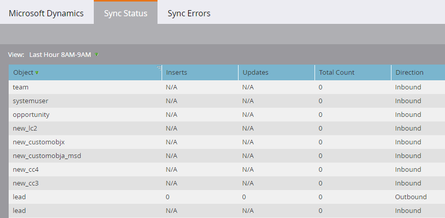

# Synkroniseringsstatus {#sync-status}

På flikarna Synkroniseringsstatus och Synkroniseringsfel kan du hålla reda på den aktuella genomströmningen och eftersläpningen i synkroniseringsprocessen.

## Fliken Synkroniseringsstatus {#sync-status-tab}

1. Klicka på **Admin** och **Microsoft Dynamics**.

   

1. Klicka på fliken **Synkroniseringsstatus**.

   

   Den här tabellen visar eftersläpningen med infogningar och uppdateringar som ännu inte har synkroniserats för varje objekt.

1. Dubbelklicka på valfri rad för att visa information om affärsmöjligheter.

   

   Synkroniseringsstatusinformationen är uppdelad efter infogningar och uppdateringar samt äldsta infognings- och uppdateringsposter.

   

1. Klicka på **Visa: **listruta** **och välj **Senaste timma **för att visa genomströmningsinformation.

   

   Nu visas antalet poster som synkroniserats under den senaste heltimmen (till exempel 1-2:00).

   

   >[!NOTE]
   >
   >När du tittar på vyn Senaste timma visas kolumnerna Infogar och uppdateringar som inget. Detta är förväntat beteende.

## Fliken Synkroniseringsfel {#sync-errors-tab}

Sök, sök och exportera leads (och andra objekt) som inte kunde synkroniseras med information som åtgärd, riktning, felkod och felmeddelande.

>[!MORELIKETHIS]
>
>* [Meddelandetyper](../../../../product-docs/core-marketo-concepts/miscellaneous/understanding-notifications/notification-types.md)

