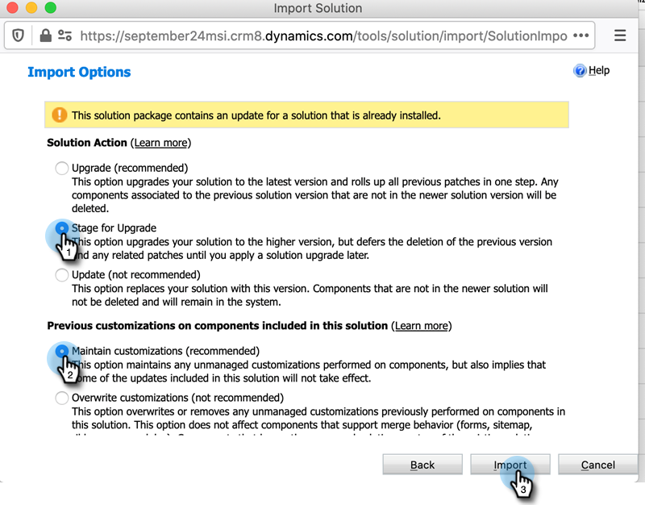
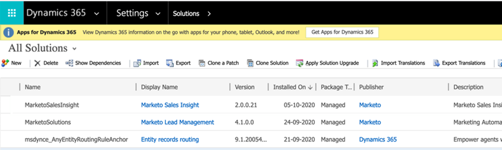

# Plug-in-versioner för Microsoft Dynamics MSI {#plug-in-releases-for-microsoft-dynamics-msi}

När du först synkroniserar med Microsoft Dynamics hämtar och installerar du den senaste versionen av plugin-programmen för Marketo Sales Insight (MSI). Marketo uppdaterar regelbundet dessa plugin-program så att du kan gå tillbaka till samma ställe och ladda ned den nya versionen.

[Hämta det senaste plugin-programmet](/help/marketo/product-docs/marketo-sales-insight/msi-for-microsoft-dynamics/installing/download-the-marketo-sales-insight-solution-for-microsoft-dynamics.md) som motsvarar din Dynamics-release.

>[!NOTE]
>
>Dessa versioner fungerar både lokalt och online för Dynamics.

## Uppgraderar din MSI-lösning {#upgrading-your-msi-solution}

1. Importera den senaste versionen av lösningen _över den befintliga versionen_ av Dynamics CRM genom att trycka på knappen **Importera** i Dynamics.

   

>[!NOTE]
>
>Exempel: om din Dynamics CRM har version 2.0.0.20 och den senaste versionen är 2.0.0.21, importerar du _över version 2.0.0.20._

1. Klicka på **Nästa**.

   

1. Välj **Scen för uppgradering** och **Behåll anpassningar** och klicka sedan på **Importera**.

   

1. Klicka på **Nästa**.

   

1. Efter en lyckad import ser du två MSI-lösningar: MarketoSalesInsight och MarketoSalesInsight_Upgrade. Välj den äldre lösningen och klicka på Tillämpa uppgradering av lösning.

   

Och det är allt! Efter uppgraderingen visas bara en MSI-lösning.

## Versionsuppdateringar {#version-updates}

<table> 
 <colgroup> 
  <col> 
  <col> 
  <col> 
 </colgroup> 
 <tbody> 
  <tr> 
   <th colspan="1">Releasedatum</th> 
   <th colspan="1">Version</th> 
   <th colspan="1">Anteckningar</th> 
  </tr> 
  <tr> 
   <td colspan="1">10/1/20</td> 
   <td colspan="1">2.0.0.21</td> 
   <td colspan="1">Felkorrigering: Tilldela åtkomst till MSI API-konfigurationsfält för användare med rollen Sales Insight</td> 
  </tr> 
  <tr> 
   <td colspan="1">07/20/20</td> 
   <td colspan="1">2.0.0.20</td> 
   <td colspan="1">Felkorrigering: Lägg till ett valideringsmeddelande för osynkroniserade poster</td> 
  </tr> 
  <tr> 
   <td colspan="1">06/12/20</td> 
   <td colspan="1">2.0.0.19</td> 
   <td colspan="1">Felkorrigering: Så här döljer du MSI-hemligt lösenord i MSD API-konfiguration</td> 
  </tr> 
  <tr> 
   <td colspan="1">05/26/20</td> 
   <td colspan="1">2.0.0.18</td> 
   <td colspan="1">Felkorrigering: Så här ändrar du MSI-roll-ID-validering för att visa MSI-knappar</td> 
  </tr> 
  <tr> 
   <td colspan="1">05/21/20</td> 
   <td colspan="1">2.0.0.17</td> 
   <td colspan="1">Felkorrigering: Visa ägarfält och göra fält icke-obligatoriska</td> 
  </tr> 
  <tr> 
   <td colspan="1">04/28/20</td> 
   <td colspan="1">2.0.0.16</td> 
   <td colspan="1">Felkorrigering: Tar bort länkberoende för inställning av platskarta för MSD CRM</td> 
  </tr> 
 </tbody> 
</table>
