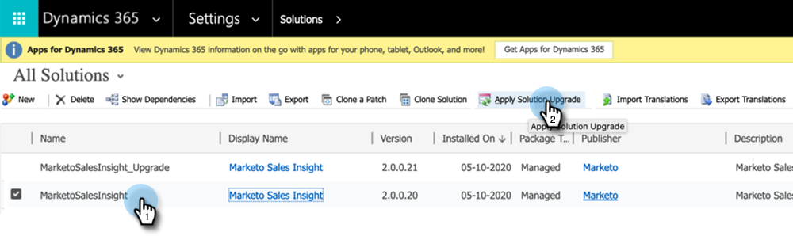

# Plug-in-versioner för [!DNL Microsoft Dynamics] MSI {#plug-in-releases-for-microsoft-dynamics-msi}

När du först synkroniserar till [!DNL Microsoft Dynamics] hämtar och installerar du den senaste versionen av plugin-programmen för Marketo Sales Insight (MSI). Marketo uppdaterar regelbundet dessa plugin-program så att du kan gå tillbaka till samma ställe och ladda ned den nya versionen.

Om du använder Marketo inbyggda CRM-synkroniseringslösning för [!DNL Dynamics] kan du [hämta det senaste plugin-programmet](/help/marketo/product-docs/marketo-sales-insight/msi-for-microsoft-dynamics/installing/download-the-marketo-sales-insight-solution-for-microsoft-dynamics.md){target="_blank"} som motsvarar din [!DNL Dynamics]-version. För dem som har en anpassad synkronisering och har köpt Marketo Sales Insight är [paketet här](https://mktg-cdn.marketo.com/community/MarketoSalesInsight_NonNative.zip){target="_blank"}.

>[!NOTE]
>
>De här versionerna fungerar för både lokala versioner och onlineversioner av [!DNL Dynamics].

## Uppgradera din MSI-lösning {#upgrading-your-msi-solution}

1. Importera den senaste versionen av lösningen _över den befintliga versionen_ av din [!DNL Dynamics] CRM genom att trycka på knappen **[!UICONTROL Import]** i [!DNL Dynamics].

   

>[!NOTE]
>
>Exempel: Om din [!DNL Dynamics] CRM har version 2.0.0.20 och den senaste versionen är 2.0.0.21 importerar du _över_ version 2.0.0.20.

1. Klicka på **[!UICONTROL Next]**.

   

1. Välj **[!UICONTROL Stage for Upgrade]** och **[!UICONTROL Maintain customizations]** och klicka sedan på **[!UICONTROL Import]**.

   

1. Klicka på **[!UICONTROL Next]**.

   

1. Efter en lyckad import ser du två MSI-lösningar: MarketoSalesInsight och MarketoSalesInsight_Upgrade. Välj den äldre lösningen och klicka på Tillämpa uppgradering av lösning.

   

Och det är allt! Efter uppgraderingen visas bara en MSI-lösning.

## Uppdateringar av versioner {#version-updates}

<table>
 <tbody>
  <tr>
   <th>Releasedatum</th>
   <th>Version</th>
   <th>Anteckningar</th>
  </tr>
  <tr>
   <td>02/14/24</td>
   <td>2.00.31</td>
   <td>Förändringar av sidnumrering i anonym webbaktivitet.
   

   Kryptera hemlig nyckelinformation från användarvyn. Lösenordet måste ändras efter att det nya paketet har importerats för att krypteringen ska kunna ske.</td>
  </tr>
  <tr>
   <td>10/18/23</td>
   <td>2.00.30</td>
   <td>Konsoliderar MSI-felloggen och tar bort informationsmeddelanden från att visas på Marketo Error Entity.</td>
  </tr>
  <tr>
   <td>05/19/23</td>
   <td>2.00.29</td>
   <td>Sidnumreringsproblem för korrigerad webbaktivitet och intressanta stunder på den globala instrumentpanelen.</td>
  </tr>
  <tr>
   <td>03/23/23</td>
   <td>2.00.28</td>
   <td>Skapade ett <a href="https://mktg-cdn.marketo.com/community/MarketoSalesInsight_NonNative.zip">nytt paket</a> för MSI för icke-ursprungliga anslutningar till CRM.</td>
  </tr>
  <tr>
   <td>02/03/22</td>
   <td>2.0.0.27</td>
   <td>Kontolayout för insikter: Intressanta stunder, poängändringar, webbaktiviteter, e-postaktiviteter.</td>
  </tr>
  <tr>
   <td>01/05/22</td>
   <td>2.0.0.26</td>
   <td>Adobes poäng för e-post med utskick.</td>
  </tr>
  <tr>
   <td>10/28/21</td>
   <td>2.0.0.25</td>
   <td>Adobes poängstatistik, nya Global Dashboard (webbaktivitet, e-post, bästa val).</td>
  </tr>
  <tr>
   <td>02/10/21</td>
   <td>2.0.0.22</td>
   <td>Ta bort automatisk granskning aktiverad och dokumentationsändringar på MSI-lösningen.</td>
  </tr>
  <tr>
   <td>10/01/20</td>
   <td>2.0.0.21</td>
   <td>Felkorrigering: Tilldela åtkomst till konfigurationsfält för MSI API för användare med rollen Sales Insight.</td>
  </tr>
  <tr>
   <td>07/20/20</td>
   <td>2.0.0.20</td>
   <td>Felkorrigering: Lägg till ett valideringsmeddelande för osynkroniserade poster.</td>
  </tr>
  <tr>
   <td>06/12/20</td>
   <td>2.0.0.19</td>
   <td>Felkorrigering: Så här döljer du MSI Secret Password i MSD API Config.</td>
  </tr>
  <tr>
   <td>05/26/20</td>
   <td>2.0.0.18</td>
   <td>Felkorrigering: Så här ändrar du MSI-roll-ID-validering för att visa MSI-knappar.</td>
  </tr>
  <tr>
   <td>05/21/20</td>
   <td>2.0.0.17</td>
   <td>Felkorrigering: Visa ägarfält och gör fält icke-obligatoriska.</td>
  </tr>
  <tr>
   <td>04/28/20</td>
   <td>2.0.0.16</td>
   <td>Felkorrigering: Tar bort länkberoendet för platskartan i MSD CRM.</td>
  </tr>
 </tbody>
</table>
