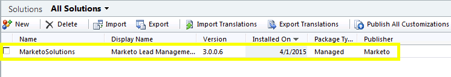

# Steg 1 av 3: Installera Marketo Solution (2011 On-Premises) {#step-of-install-the-marketo-solution-on-premises}

Innan du kan synkronisera Microsoft Dynamics On-Premises och Marketo Engage måste du först installera Marketo-lösningen i Dynamics.

>[!NOTE]
>
>När du har synkroniserat Marketo till en CRM kan du inte utföra en ny synkronisering utan att ersätta instansen.

>[!PREREQUISITES]
>
>Du måste ha konfigurerat [Internet Facing Deployment](https://www.microsoft.com/en-us/download/confirmation.aspx?id=41701){target="_blank"} (IFD) med [Active Directory Federation Services](https://msdn.microsoft.com/en-us/library/bb897402.aspx){target="_blank"} 2.0, 2.1 eller 3.0 (ADFS). **Obs!** IFD-dokumentet hämtas automatiskt när du klickar på länken.
>
>[Ladda ned Marketo Lead Management Solution](/help/marketo/product-docs/crm-sync/microsoft-dynamics-sync/sync-setup/download-the-marketo-lead-management-solution.md){target="_blank"} innan du startar.

>[!NOTE]
>
>**Dynamics-administratörsbehörigheter krävs**.
>
>Du behöver administratörsbehörighet för CRM för att kunna utföra den här synkroniseringen.

1. Logga in i Dynamics och välj **[!UICONTROL Settings]** längst ned till vänster.

   

1. Välj **[!UICONTROL Solutions]** i trädet.

   

1. Klicka på **[!UICONTROL Import]**.

   

1. Klicka på **[!UICONTROL Browse]**. Välj den Marketo Lead Management-lösning som du [hämtade](/help/marketo/product-docs/crm-sync/microsoft-dynamics-sync/sync-setup/download-the-marketo-lead-management-solution.md){target="_blank"}. Klicka på **[!UICONTROL Next]**.

   

1. Visa lösningsinformationen och klicka på **[!UICONTROL View solution package details]**.

   

1. När du har kontrollerat alla detaljer klickar du på **[!UICONTROL Close]**.

   

1. Klicka på **[!UICONTROL Next]** på sidan Lösningsinformation.

   

1. Kontrollera att kryssrutan för SDK-meddelandealternativet är markerad. Klicka på **[!UICONTROL Next]**.

   

   >[!TIP]
   >
   >Du måste aktivera popup-fönster i webbläsaren för att slutföra installationen.

1. Vänta nu tills importen är klar. Ställ dig upp och sträck lite.

   

1. Klicka på **[!UICONTROL Close]**.

   >[!NOTE]
   >
   >Du kan se ett meddelande med texten&quot;Marketo Lead Management har slutförts med varning&quot;. Detta är helt förväntat.

   

1. Marketo Lead Management visas nu på sidan **Alla lösningar**.

   

1. Välj Marketo Lead Management och klicka på **[!UICONTROL Publish All Customizations]**.

   

>[!CAUTION]
>
>Om du inaktiverar någon av meddelandeprocesserna i Marketo SDK avbryts installationen!

>[!MORELIKETHIS]
>
>[Steg 2 av 3: Konfigurera Marketo Sync-användare i Dynamics (lokal version 2011)](/help/marketo/product-docs/crm-sync/microsoft-dynamics-sync/sync-setup/connecting-to-legacy-versions/step-2-of-3-set-up-2011.md){target="_blank"}
