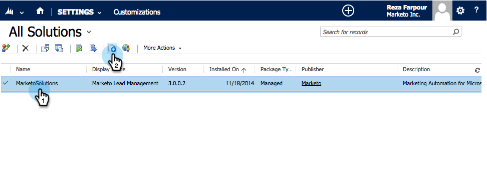

# Steg 1 av 3: Installera Marketo-lösningen i [!DNL Dynamics] (2013 On-Premises) {#step-of-install-the-marketo-solution-in-dynamics-on-premises}

Innan du kan synkronisera [!DNL Microsoft Dynamics] On-Premises och Marketo måste du först installera Marketo-lösningen i [!DNL Dynamics].

>[!NOTE]
>
>När du har synkroniserat Marketo till en CRM kan du inte utföra en ny synkronisering utan att ersätta instansen.

>[!PREREQUISITES]
>
>Du måste ha [Internet Facing Deployment](https://learn.microsoft.com/en-us/dynamics365/customerengagement/on-premises/deploy/configure-an-internet-facing-deployment){target="_blank"} (IFD) med [Active Directory Federation Services](https://msdn.microsoft.com/en-us/library/bb897402.aspx){target="_blank"} 2.0, 2.1 eller 3.0 (ADFS) konfigurerat. Obs! IFD-dokumentet laddas ned automatiskt när du klickar på länken.
>
>[Ladda ned Marketo-lösningen](/help/marketo/product-docs/crm-sync/microsoft-dynamics-sync/sync-setup/download-the-marketo-lead-management-solution.md){target="_blank"} innan du börjar.

>[!NOTE]
>
>**[!DNL Dynamics]Administratörsbehörigheter krävs.**
>
>Du behöver administratörsbehörighet för CRM för att kunna utföra den här synkroniseringen.

1. Logga in på **[!DNL Dynamics]**. Klicka på listrutan **[!UICONTROL Microsoft Dynamics CRM]** och välj **[!UICONTROL Settings]**.

   

1. Välj **[!UICONTROL Settings]** under **[!UICONTROL Solutions]**.

   

1. Klicka på **[!UICONTROL Import]**.

   

1. Klicka på **[!UICONTROL Browse]** och välj den [hämtade lösningen](/help/marketo/product-docs/crm-sync/microsoft-dynamics-sync/sync-setup/download-the-marketo-lead-management-solution.md). Klicka på **[!UICONTROL Next]**.

   

1. Visa [!UICONTROL Solution Information] och klicka på **[!UICONTROL View solution package details]**.

   

1. När du har kontrollerat alla detaljer klickar du på **[!UICONTROL Close]**.

   

1. Klicka på [!UICONTROL Solution Information] på sidan **[!UICONTROL Next]**.

   

1. Kontrollera att alternativet SDK är markerat. Klicka på **[!UICONTROL Import]**.

   

1. Vänta tills importen är klar.

   >[!TIP]
   >
   >Du måste aktivera popup-fönster i webbläsaren för att slutföra installationen.

   

1. Hämta en loggfil (om du vill) och klicka på **[!UICONTROL Close]**.

   >[!NOTE]
   >
   >Du kan se ett meddelande med texten&quot;Marketo Lead Management har slutförts med varning&quot;. Detta är helt förväntat.

   

1. Marketo Lead Management visas nu på sidan **[!UICONTROL All Solutions]**.

   

1. Välj Marketo-lösningen och klicka på **[!UICONTROL Publish all Customizations]**.

   

>[!CAUTION]
>
>Om du inaktiverar någon av meddelandeprocesserna i Marketo SDK avbryts installationen!

>[!MORELIKETHIS]
>
>[Steg 2 av 3: Konfigurera Synkronisera användare för Marketo (lokal version 2013)](/help/marketo/product-docs/crm-sync/microsoft-dynamics-sync/sync-setup/connecting-to-legacy-versions/step-2-of-3-configure-2013.md){target="_blank"}
