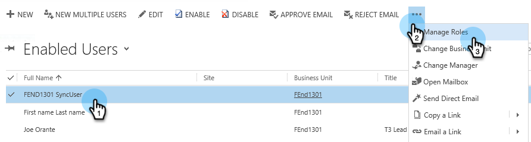

# Steg 2 av 3: Konfigurera Synkronisera användare för Marketo (lokal version 2013) {#step-of-configure-sync-user-for-marketo-on-premises}

Bra jobb med att slutföra de föregående stegen - vi går igenom det här.

>[!PREREQUISITES]
>
>[Steg 1 av 3: Installera Marketo Solution i Dynamics (2013 On-Premises)](/help/marketo/product-docs/crm-sync/microsoft-dynamics-sync/sync-setup/connecting-to-legacy-versions/step-1-of-3-install-2013.md)

## Tilldela synkroniseringsanvändarroll {#assign-sync-user-role}

Tilldela endast Marketo Sync User-rollen till Marketo sync-användaren. Du behöver inte tilldela den till andra användare.

>[!NOTE]
>
>Detta gäller Marketo plugin version 4.0.0.14 och senare. I tidigare versioner måste alla användare ha synkroniseringsanvändarrollen. Om du vill uppgradera Marketo går du till [Uppgradera Marketo Solution for Microsoft Dynamics](/help/marketo/product-docs/crm-sync/microsoft-dynamics-sync/sync-setup/update-the-marketo-solution-for-microsoft-dynamics.md).

>[!IMPORTANT]
>
>Språkinställningen för Synkronisera användare [ska anges till engelska](https://portal.dynamics365support.com/knowledgebase/article/KA-01201/en-us).

1. Under **Inställningar**, klicka **Administration**.

   

1. Välj **Användare**.

   

1. En lista över användare visas här. Välj en dedikerad Marketo Sync-användare eller kontakta [Active Directory Federation Services (AFDS)](https://msdn.microsoft.com/en-us/library/bb897402.aspx) [administratör för att skapa en ny användare som är dedikerad till Marketo.](https://blogs.technet.com/b/askpfeplat/archive/2014/04/21/introduction-to-active-directory-federation-services-ad-fs-alternateloginid-feature.aspx)

   

1. Välj synkroniseringsanvändare. Klicka  och markera **Hantera roller**

   

1. Kontrollera **Marketo Sync User** och klicka **OK**.

   

   >[!TIP]
   >
   >Om du inte ser rollen går du tillbaka till [steg 1 av 3](/help/marketo/product-docs/crm-sync/microsoft-dynamics-sync/sync-setup/microsoft-dynamics-2013-on-premises/step-1-of-3-install.md) och importera lösningen.

   >[!NOTE]
   >
   >Alla uppdateringar som görs i CRM av Synkronisera användare kommer att **not** synkas tillbaka till Marketo.

## Konfigurera Marketo Solution {#configure-marketo-solution}

Nästan klart! Vi har bara några sista konfigurationer innan vi går vidare till nästa artikel.

1. Under **Inställningar**, klicka **Marketo Config**.

   

   >[!NOTE]
   >
   >If **Marketo Config** saknas, försök att uppdatera sidan. Om problemet kvarstår [publicera Marketo](/help/marketo/product-docs/crm-sync/microsoft-dynamics-sync/sync-setup/microsoft-dynamics-2013-on-premises/step-1-of-3-install.md) igen eller försök logga ut och sedan in igen.

1. Klicka **Standard**.

   

1. Klicka på **Marketo-användare** och välj synkroniseringsanvändare.

   

1. Klicka  i det nedre högra hörnet för att spara ändringarna.

   

1. Klicka **Publicera alla anpassningar**.

   

## Innan du fortsätter till steg 3 {#before-proceeding-to-step}

* Om du vill begränsa antalet poster som du synkroniserar, [konfigurera ett eget synkroniseringsfilter](/help/marketo/product-docs/crm-sync/microsoft-dynamics-sync/create-a-custom-dynamics-sync-filter.md) nu.
* Kör [Validera Microsoft Dynamics Sync](/help/marketo/product-docs/crm-sync/microsoft-dynamics-sync/sync-setup/validate-microsoft-dynamics-sync.md) -processen. Den verifierar att dina initiala inställningar har gjorts korrekt.
* Logga in i Marketo Sync User i Microsoft Dynamics CRM.

Bra jobbat!

>[!MORELIKETHIS]
>
>[Steg 3 av 3: Connect Marketo and Dynamics (2013 On-Premises)](/help/marketo/product-docs/crm-sync/microsoft-dynamics-sync/sync-setup/microsoft-dynamics-2013-on-premises/step-3-of-3-connect.md)
