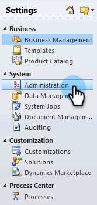

# Steg 2 av 3: Konfigurera Marketo Sync User i [!DNL Dynamics] (On-Premises 2011) {#step-of-set-up-marketo-sync-user-in-dynamics-on-premises}

Bra jobb med att slutföra de föregående stegen - vi går igenom det här.

>[!PREREQUISITES]
>
>[Steg 1 av 3: Installera Marketo Solution (2011 On-Premises)](/help/marketo/product-docs/crm-sync/microsoft-dynamics-sync/sync-setup/connecting-to-legacy-versions/step-1-of-3-install-2011.md){target="_blank"}

## Tilldela synkroniseringsanvändarroll {#assign-sync-user-role}

Tilldela endast Marketo Sync User-rollen till Marketo sync-användaren. Du behöver inte tilldela den till andra användare.

>[!NOTE]
>
>Detta gäller Marketo plugin-version 4.0.0.14 och senare. I tidigare versioner måste alla användare ha synkroniseringsanvändarrollen. Mer information om hur du uppgraderar Marketo finns i [Uppgradera Marketo-lösningen för [!DNL Microsoft Dynamics]](/help/marketo/product-docs/crm-sync/microsoft-dynamics-sync/sync-setup/update-the-marketo-solution-for-microsoft-dynamics.md).

>[!IMPORTANT]
>
>Språkinställningen för synkroniseringsanvändaren [ ska anges till engelska](https://learn.microsoft.com/en-us/power-platform/admin/enable-languages){target="_blank"}.

1. Välj **[!UICONTROL Settings]** på den nedre vänstra menyn.

   

1. Välj **[!UICONTROL Administration]** i trädet.

   

1. Välj **[!UICONTROL Users]**.

   

1. En lista över användare visas här. Välj en dedikerad Marketo-synkroniseringsanvändare eller kontakta din [Active Directory Federation Services-administratör (AFDS)](https://msdn.microsoft.com/en-us/library/bb897402.aspx) för att skapa en ny användare som är dedikerad till Marketo. Klicka på **[!UICONTROL Manage Roles]**.

   

1. Markera **[!UICONTROL Marketo Sync User]** och klicka på **[!UICONTROL OK]**.

   

   >[!TIP]
   >
   >Om du inte ser rollen går du tillbaka till [steg 1 av 3](/help/marketo/product-docs/crm-sync/microsoft-dynamics-sync/sync-setup/connecting-to-legacy-versions/step-1-of-3-install-2011.md){target="_blank"} och importerar lösningen.

   >[!NOTE]
   >
   >Alla uppdateringar som görs i CRM av Synkronisera användare _synkroniseras inte_ tillbaka till Marketo.

## Konfigurera Marketo Solution {#configure-marketo-solution}

Nästan klart! Vi har bara några sista konfigurationer innan vi går vidare till nästa artikel.

1. Välj **[!UICONTROL Settings]**. Välj sedan **[!UICONTROL Marketo Config]** i trädet.

   

   >[!NOTE]
   >
   >Om [!UICONTROL Marketo Config] saknas kan du försöka uppdatera sidan. Om problemet kvarstår [publicerar du Marketo-lösningen igen](/help/marketo/product-docs/crm-sync/microsoft-dynamics-sync/sync-setup/connecting-to-legacy-versions/step-1-of-3-install-2011.md) eller loggar ut och in igen.

1. Klicka på **[!UICONTROL Default]**.

   

1. Klicka på 

   

1. Markera synkroniseringsanvändaren i popup-fönstret. Klicka sedan på **[!UICONTROL OK]**.

   

1. Klicka på **[!UICONTROL Save]** om du vill spara ändringarna.

   

1. Klicka på **[!UICONTROL Publish All Customizations]**.

   

## Innan du fortsätter till steg 3 {#before-proceeding-to-step}

    * Om du vill begränsa antalet poster som du synkroniserar [konfigurera ett anpassat synkroniseringsfilter](/help/marketo/product-docs/crm-sync/microsoft-dynamics-sync/create-a-custom-dynamics-sync-filter.md) nu.
    * Kör processen [Validera [!DNL Microsoft Dynamics] Synkronisera](/help/marketo/product-docs/crm-sync/microsoft-dynamics-sync/sync-setup/validate-microsoft-dynamics-sync.md). Den verifierar att dina initiala inställningar har gjorts korrekt.
    * Logga in i Marketo Sync User i [!DNL Microsoft Dynamics] CRM.

Snyggt jobb!

>[!MORELIKETHIS]
>
>[Steg 3 av 3: Anslut [!DNL Microsoft Dynamics] med Marketo (lokal version 2011)](/help/marketo/product-docs/crm-sync/microsoft-dynamics-sync/sync-setup/connecting-to-legacy-versions/step-3-of-3-connect-2011.md)
