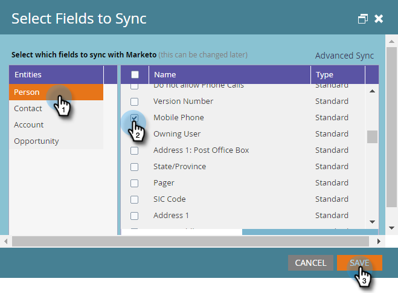
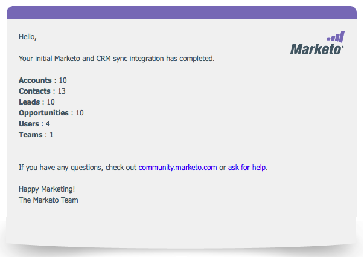

# Steg 3 av 3: Anslut Marketo och [!DNL Dynamics] (lokal version 2013) {#step-of-connect-marketo-and-dynamics-on-premises}

Okej! Vi installerade lösningen och konfigurerade synkroniseringsanvändaren. Därefter måste vi ansluta Marketo och [!DNL Dynamics].

>[!PREREQUISITES]
>
>* [Steg 1 av 3: Installera Marketo-lösningen i [!DNL Dynamics] (2013 On-Premises)](/help/marketo/product-docs/crm-sync/microsoft-dynamics-sync/sync-setup/connecting-to-legacy-versions/step-1-of-3-install-2013.md)
>* [Steg 2 av 3: Konfigurera Synkronisera användare för Marketo (lokal version 2013)](/help/marketo/product-docs/crm-sync/microsoft-dynamics-sync/sync-setup/connecting-to-legacy-versions/step-2-of-3-configure-2013.md)

>[!NOTE]
>
>**Administratörsbehörigheter krävs**

## Ange [!DNL Dynamics] synkroniseringsanvändarinformation {#enter-dynamics-sync-user-information}

1. Logga in på Marketo och klicka på **[!UICONTROL Admin]**.

   

1. Klicka på **[!UICONTROL CRM]**.

   

1. Välj **[!DNL Microsoft]**.

   

1. Klicka på **[!UICONTROL Edit]** i **[!UICONTROL Step 1: Enter Credentials]**.

   

   >[!CAUTION]
   >
   >Kontrollera att dina autentiseringsuppgifter är korrekta eftersom det inte går att återställa efterföljande schemaändringar efter överföringen. Om felaktiga uppgifter sparas måste du skaffa en ny Marketo-prenumeration.

1. Ange **[!UICONTROL Username]**, **[!UICONTROL Password]** och [!DNL Microsoft Dynamics] **URL** och klicka sedan på **[!UICONTROL Save]**.

   

   >[!NOTE]
   >
   >* Användarnamnet i Marketo måste matcha användarnamnet för synkroniseringsanvändaren i CRM. Formatet kan vara `user@domain.com` eller DOMÄN\användare.
   >* Om du inte känner till URL:en kan du [lära dig att hitta den här](/help/marketo/product-docs/crm-sync/microsoft-dynamics-sync/sync-setup/view-the-organization-service-url.md){target="_blank"}.

## Markera fält som ska synkroniseras {#select-fields-to-sync}

Nu måste vi markera de fält vi vill synkronisera.

1. Klicka på **[!UICONTROL Edit]** i **[!UICONTROL Step 2: Select Fields to Sync]**.

   

1. Markera de fält som du vill synkronisera till Marketo så att de är förmarkerade. Klicka på **[!UICONTROL Save]**.

   

   >[!NOTE]
   >
   >Marketo lagrar en referens till de fält som ska synkroniseras. Om du tar bort ett fält i [!DNL Dynamics] rekommenderar vi att du gör det med [synkroniseringen inaktiverad](/help/marketo/product-docs/crm-sync/salesforce-sync/enable-disable-the-salesforce-sync.md). Uppdatera sedan schemat i Marketo genom att redigera och spara [[!UICONTROL Select Fields to Sync]](/help/marketo/product-docs/crm-sync/microsoft-dynamics-sync/microsoft-dynamics-sync-details/microsoft-dynamics-sync-field-sync/editing-fields-to-sync-before-deleting-them-in-dynamics.md).

## Synkronisera fält för ett eget filter {#sync-fields-for-a-custom-filter}

Om du har skapat ett eget filter måste du gå in och välja de nya fält som ska synkroniseras med Marketo.

1. Gå till [!UICONTROL Admin] och välj **[!UICONTROL Microsoft Dynamics]**.

   

1. Klicka på **[!UICONTROL Edit]** på [!UICONTROL Field Sync Details].

   

1. Rulla ned till fältet och kontrollera det. Det faktiska namnet måste vara new_synctomkto, men visningsnamnet kan vara vad som helst. Klicka på **[!UICONTROL Save]**.

   

## Aktivera synkronisering {#enable-sync}

1. Klicka på **[!UICONTROL Edit]** i **[!UICONTROL Step 3: Enable Sync]**.

   

   >[!CAUTION]
   >
   >Marketo avduplicerar inte automatiskt mot en [!DNL Microsoft Dynamics]-synkronisering eller när du anger personer eller leads manuellt.

1. Läs allt i popup-fönstret, ange din e-postadress och klicka på **[!UICONTROL Start Sync]**.

   

1. Beroende på antalet poster kan den inledande synkroniseringen ta från några timmar till några dagar var som helst. Du får ett e-postmeddelande när du är klar.

   

Utmärkt arbete! Du har just frigjort kraften i den dubbelriktade synkroniseringen mellan Marketo och [!DNL Microsoft Dynamics]. Om du har köpt [!DNL Marketo Sales Insight] finns det mer kul att ha:

>[!MORELIKETHIS]
>
>[Installera och konfigurera [!DNL Marketo Sales Insight] i [!DNL Microsoft Dynamics] 2013](/help/marketo/product-docs/marketo-sales-insight/msi-for-microsoft-dynamics/installing/install-and-configure-marketo-sales-insight-in-microsoft-dynamics-2013.md)
