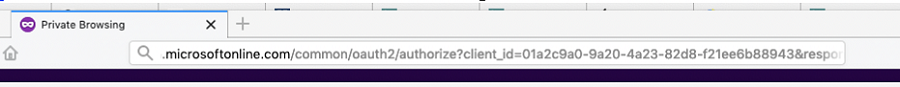

# Bevilja samtycke för klient-ID och appregistrering {#grant-consent-for-client-id-and-app-registration}

## Bevilja delegerade användarbehörigheter för synkroniseringsanvändaren {#grant-delegated-user-permissions-for-the-sync-user}

1. Använd ett rent textprogram (Anteckningar för Windows, Textredigering för Mac) för att skapa en URI (Uniform Resource Identifier) för auktorisering genom att klistra in texten nedan och ersätta värdena client_id, redirect_uri och state.

   ```
   https://login.microsoftonline.com/common/oauth2/authorize?
   client_id='xxxxxx-xxxx-xxxx-xxxx-xxxxxxxx'
   &response_type='code'
   &redirect_uri='https://www.<ourdomain>.com'
   &response_mode='query'
   &state='SOME_UNIQUE_UID'
   client_id value should be the client_id generated in App Registration process
   redirect_uri value should be same as value entered at the time of App registration-> Redirect URIs
   state value can be any ID (e.g.,12345)
   ```

   <table> 
    <colgroup> 
     <col> 
     <col> 
    </colgroup> 
    <tbody> 
     <tr> 
      <td><strong>client_id-värde</strong></td> 
      <td>ska vara client_id som genereras i appregistreringsprocessen</td> 
     </tr> 
     <tr> 
      <td><strong>redirect_uri-värde</strong></td> 
      <td>ska vara samma som det värde som anges vid tidpunkten för appregistrering &gt; Omdirigerings-URI:er</td> 
     </tr> 
     <tr> 
      <td><strong>lägesvärde</strong></td> 
      <td>kan vara vilket ID som helst (t.ex. 12345)</td> 
     </tr> 
    </tbody> 
   </table>

   Den slutliga URL:en ska se ut ungefär så här: `https://login.microsoftonline.com/common/oauth2/authorize?client_id=xxxxxx-xxxx-xxxx-xxxx-xxxxxxxx&response_type=code&redirect_uri=https://www.marketo.com&response_mode=query&state=12345`

1. Öppna den URI som du skapade i valfri webbläsare.

   

1. Logga in som den synkroniseringsanvändare du beviljar behörigheter för.

   

   >[!NOTE]
   >
   >Om du redan är inloggad på Azure som administratör på en annan flik måste du använda en annan webbläsare eller ett annat Incognito-läge för att logga in som synkroniseringsanvändare.

1. Klicka **Acceptera**.

   

## Bevilja samtycke för alla användare {#grant-consent-for-all-users}

Som administratör kan du även godkänna ett programs delegerade behörigheter för alla användare i din klientorganisation. Administrativt samtycke förhindrar att dialogrutan för samtycke visas för varje användare i klienten och kan göras i Azure-portalen av användare med administratörsrollen. Lär dig vilka administratörsroller som kan [godkännande av delegerade behörigheter här](https://docs.microsoft.com/en-us/azure/active-directory/roles/permissions-reference).

1. Gå till programmets startsida på din Azure-portal.

1. Under Hantera klickar du på **API-behörigheter**.

   

1. Klicka på **Medgivande från bidragsadministratör** (för klientorganisation).

   

1. Klicka **Ja** för att bekräfta.

   

