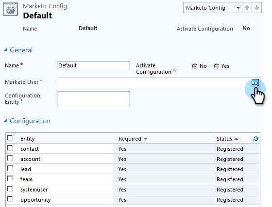

# Steg 2 av 3: Konfigurera Marketo Sync User in Dynamics (On-Premises 2011) {#step-of-set-up-marketo-sync-user-in-dynamics-on-premises}

Bra jobb med att slutföra de föregående stegen - vi går igenom det här.

>[!PREREQUISITES]
>
>[Steg 1 av 3: Installera Marketo-lösningen (2011 On-Premises)](/help/marketo/product-docs/crm-sync/microsoft-dynamics-sync/sync-setup/microsoft-dynamics-2011-on-premises/step-1-of-3-install.md)

## Tilldela synkroniseringsanvändarroll {#assign-sync-user-role}

Tilldela endast Marketo-synkroniseringsanvändarrollen till Marketför att synkronisera användare. Du behöver inte tilldela den till andra användare.

>[!NOTE]
>
>Detta gäller Marketo plugin version 4.0.0.14 och senare. I tidigare versioner måste alla användare ha synkroniseringsanvändarrollen. Mer information om hur du uppgraderar Marketo finns i [Uppgradera Marketo-lösningen för Microsoft Dynamics](/help/marketo/product-docs/crm-sync/microsoft-dynamics-sync/sync-setup/upgrade-the-marketo-solution-for-microsoft-dynamics.md).

1. Välj **Inställningar** i den nedre vänstra menyn.

   

1. Välj **Administration** i trädet.

   

1. Välj **Användare**.

   

1. En lista över användare visas här. Markera din dedikerade Marknad för att synkronisera användare eller kontakta din [AFDS-administratör (Active Directory Federation Services)](https://msdn.microsoft.com/en-us/library/bb897402.aspx) för att skapa en ny användare som är dedikerad till Marketo. Klicka på **Hantera roller**.

   

1. Markera **Marketo Sync User** och klicka på **OK**.

   

   >[!TIP]
   >
   >Om du inte ser rollen går du tillbaka till [steg 1 av 3](/help/marketo/product-docs/crm-sync/microsoft-dynamics-sync/sync-setup/microsoft-dynamics-2011-on-premises/step-1-of-3-install.md) och importerar lösningen.

   >[!NOTE]
   >
   >Alla uppdateringar som görs i CRM av Sync User kommer **inte** att synkroniseras tillbaka till Marketo.

## Konfigurera Marketo-lösning {#configure-marketo-solution}

Nästan klart! Vi har bara några sista konfigurationer innan vi går vidare till nästa artikel.

1. Välj **Inställningar**. Välj sedan **Marketo Config** i trädet.

   

   >[!NOTE]
   >
   >Om Marketo Config saknas kan du försöka uppdatera sidan. Om problemet kvarstår kan du [publicera Marketo-lösningen igen](/help/marketo/product-docs/crm-sync/microsoft-dynamics-sync/sync-setup/microsoft-dynamics-2011-on-premises/step-1-of-3-install.md) eller logga ut och in igen.

1. Klicka på **Standard**.

   

1. Klicka på 

   

1. Markera synkroniseringsanvändaren i popup-fönstret. Klicka sedan på **OK**.

   

1. Klicka på **Spara** för att spara ändringarna.

   

1. Klicka på **Publicera alla anpassningar**.

   

## Innan du fortsätter till steg 3 {#before-proceeding-to-step}

    * Om du vill begränsa antalet poster som du synkroniserar [konfigurera ett anpassat synkroniseringsfilter](/help/marketo/product-docs/crm-sync/microsoft-dynamics-sync/create-a-custom-dynamics-sync-filter.md) nu.
    * Kör processen [Validera Microsoft Dynamics Sync](/help/marketo/product-docs/crm-sync/microsoft-dynamics-sync/sync-setup/validate-microsoft-dynamics-sync.md). Den verifierar att dina initiala inställningar har gjorts korrekt.
    * Logga in på Marketo Sync User i Microsoft Dynamics CRM.

Bra jobbat!

>[!MORELIKETHIS]
>
>[Steg 3 av 3: Anslut Microsoft Dynamics med Marketo (On-Premises 2011)](/help/marketo/product-docs/crm-sync/microsoft-dynamics-sync/sync-setup/microsoft-dynamics-2011-on-premises/step-3-of-3-connect.md)
