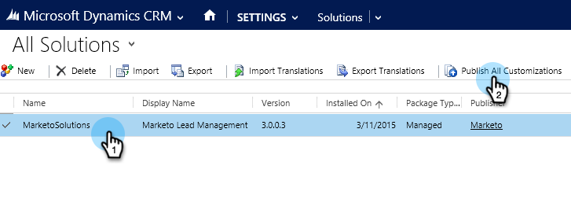

# Steg 1 av 3: Konfigurera Synkronisera användare för Marketo (On-Prem 2015 och 2016 365 On-Prem) {#step-of-configure-sync-user-for-marketo-on-premises-and-365}

Innan du kan synkronisera Microsoft Dynamics 2015 On-Premises eller 2016 (Dynamics 365) med Marketo måste du först installera Marketo-lösningen i Dynamics.

>[!NOTE]
>
>När du har synkroniserat Marketo till en CRM kan du inte synkronisera en ny CRM till den befintliga Marketo-instansen.

>[!PREREQUISITES]
>
>Om du använder Microsoft Dynamics On-Premise måste du ha [Internet Facing Deployment](https://www.microsoft.com/en-us/download/confirmation.aspx?id=41701) (IFD) med [Active Directory Federation Services](https://msdn.microsoft.com/en-us/library/bb897402.aspx) 2.0+ (ADFS) konfigurerat. Obs! IFD-dokumentet laddas ned automatiskt när du klickar på länken.
>
>[Ladda ned Marketo Lead Management ](/help/marketo/product-docs/crm-sync/microsoft-dynamics-sync/sync-setup/download-the-marketo-lead-management-solution.md) Solution innan du börjar.

>[!NOTE]
>
>**Administratörsbehörigheter för Dynamics krävs.**
>
>Du behöver administratörsbehörighet för CRM för att kunna utföra den här synkroniseringen.

1. Logga in på **Dynamics.** Klicka på listrutan  **Microsoft Dynamics** CRM och välj  **Inställningar**.

   

1. Under **Inställningar** väljer du **Lösningar**.

   

1. Klicka på **Importera**.

   

1. Klicka på **Bläddra** och välj den lösning du [hämtade](/help/marketo/product-docs/crm-sync/microsoft-dynamics-sync/sync-setup/download-the-marketo-lead-management-solution.md). Klicka på **Nästa**.

   

1. Visa lösningsinformationen och klicka på **Visa information om lösningspaketet**.

   

1. När du är klar med att kontrollera all information klickar du på **Stäng**.

   

1. Gå tillbaka till sidan Lösningsinformation och klicka på **Nästa**.

   

1. Kontrollera att kryssrutan för SDK-alternativet är markerad. Klicka på **Importera**.

   

1. Vänta tills importen är klar.

   >[!TIP]
   >
   >Du måste aktivera popup-fönster i webbläsaren för att slutföra installationen.

   

1. Hämta en loggfil (om du vill) och klicka på **Stäng**.

   >[!NOTE]
   >
   >Du kan se ett meddelande med texten&quot;Marketo Lead Management klar med varning&quot;. Detta är helt förväntat.

   

1. Marketo Lead Management visas nu på sidan **Alla lösningar**.

   

1. Välj Marketo-lösningen och klicka på **Publicera alla anpassningar**.

   

   Hög fem! Installationen är klar.

   >[!CAUTION]
   >
   >Om du inaktiverar någon av Marketo SDK-meddelandeprocesserna avbryts installationen!

   >[!MORELIKETHIS]
   >
   >[Installera Marketo för Dynamics 2015 On-Prem och 2016 365 On-Prem Step 2 of 3](/help/marketo/product-docs/crm-sync/microsoft-dynamics-sync/sync-setup/microsoft-dynamics-2015-on-premises-2016-dynamics-365-on-premises/step-2-of-3-set-up.md)
