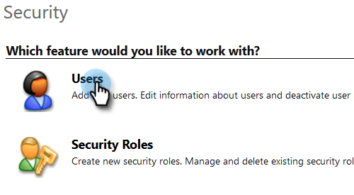
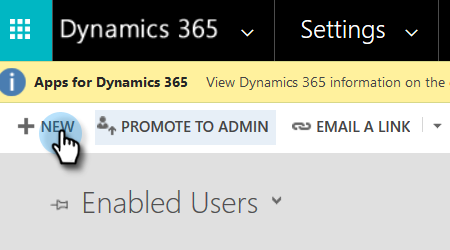
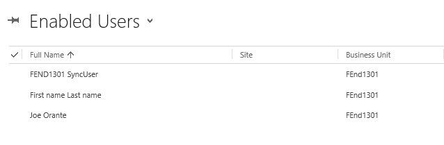
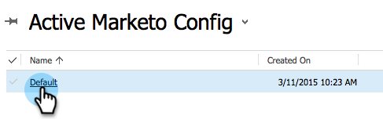
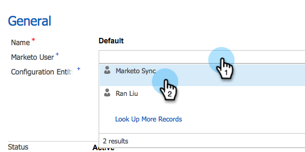

# Steg 2 av 3 Konfigurera Marketo för [!DNL Dynamics] (2016 On-Prem/[!DNL Dynamics] 365 On-Premises){#step-of-set-up-for-marketo-on-premises-2016}

Utmärkt jobb med att slutföra föregående steg. Vi går igenom det här.

>[!PREREQUISITES]
>
>[Installera Marketo för [!DNL Microsoft Dynamics] 2016/[!DNL Dynamics] 365 On-Premises Steg 1 av 3](/help/marketo/product-docs/crm-sync/microsoft-dynamics-sync/sync-setup/microsoft-dynamics-2016-dynamics-365-on-premises/step-1-of-3-install.md)

## Skapa en ny användare {#create-a-new-user}

1. Logga in på [!DNL Dynamics]. Klicka på ikonen Inställningar och välj Avancerade inställningar.

   

1. Klicka på **[!UICONTROL Settings]** och välj **[!UICONTROL Security]**.

   

1. Klicka på **[!UICONTROL Users]**.

   

1. Klicka på **[!UICONTROL New]**.

   

1. Klicka på **[!UICONTROL Add and License Users]**. En ny flik ska öppnas.

   

1. Klicka på **[!UICONTROL Admin]** överst på sidan. En annan ny flik bör öppnas.

   

1. Klicka på **[!UICONTROL Add a user]**.

   

1. Ange all information. När du är klar klickar du på **[!UICONTROL Add]**.

   

   >[!NOTE]
   >
   >Det här namnet måste vara en dedikerad synkroniseringsanvändare och inte en befintlig CRM-användares konto. Det behöver inte vara en faktisk e-postadress.

1. Ange e-postadressen som ska ta emot inloggningsuppgifterna och klicka på Skicka e-post och stäng.

   

## Skapa ett nytt klientprogram {#create-a-new-client-application}

Följ stegen i [den här Microsoft-artikeln](https://docs.microsoft.com/en-us/windows-server/identity/ad-fs/development/enabling-oauth-confidential-clients-with-ad-fs#create-an-application-group-in-ad-fs-2016-or-later) för att skapa ett nytt klientprogram och bevilja behörigheter. Observera klient-ID/hemlighet för klientprogrammet [!DNL Dynamics].

## Tilldela synkroniseringsanvändarroll {#assign-sync-user-role}

Tilldela endast Marketo Sync User-rollen till Marketo sync-användaren. Du behöver inte tilldela den till andra användare.

>[!NOTE]
>
>Detta gäller för Marketo version 4.0.0.14 och senare. I tidigare versioner måste alla användare ha synkroniseringsanvändarrollen. Mer information om hur du uppgraderar din Marketo finns i [Uppgradera Marketo-lösningen för [!DNL Microsoft Dynamics]](/help/marketo/product-docs/crm-sync/microsoft-dynamics-sync/sync-setup/update-the-marketo-solution-for-microsoft-dynamics.md).

>[!IMPORTANT]
>
>Språkinställningen för synkroniseringsanvändaren [&#x200B; ska anges till engelska](https://learn.microsoft.com/en-us/power-platform/admin/enable-languages){target="_blank"}.

1. Klicka på **[!UICONTROL Settings]** under **[!UICONTROL Security]**.

   

1. Klicka på **[!UICONTROL Users]**.

   

1. En lista över användare visas här. Välj den dedikerade Marketo Sync-användaren eller kontakta din [ADFS-administratör (Active Directory Federation Services)](https://msdn.microsoft.com/en-us/library/bb897402.aspx){target="_blank"} för att skapa en dedikerad användare för Marketo.

   

1. Välj synkroniseringsanvändare. Klicka på **[!UICONTROL Manage Roles]**.

   

1. Markera Marketo Sync User och klicka på **[!UICONTROL OK]**.

   

   >[!TIP]
   >
   >Om du inte ser rollen går du tillbaka till [steg 1 av 3](/help/marketo/product-docs/crm-sync/microsoft-dynamics-sync/sync-setup/microsoft-dynamics-2016-dynamics-365-on-premises/step-1-of-3-install.md) och importerar lösningen.

   >[!NOTE]
   >
   >Alla uppdateringar som görs i CRM av Synkronisera användare _synkroniseras inte_ tillbaka till Marketo.

## Konfigurera Marketo Solution {#configure-marketo-solution}

Nästan klart! Vi har bara några sista konfigurationer innan vi går vidare till nästa artikel.

1. Klicka på **[!UICONTROL Settings]** under **[!UICONTROL Marketo Config]**.

   

   >[!NOTE]
   >
   >Om Marketo Config saknas kan du försöka uppdatera sidan. Om problemet kvarstår [publicerar du Marketo Solution](/help/marketo/product-docs/crm-sync/microsoft-dynamics-sync/sync-setup/microsoft-dynamics-2016-dynamics-365-on-premises/step-1-of-3-install.md){target="_blank"} eller försöker logga ut och sedan in igen.

1. Klicka på **[!UICONTROL Default]**.

   

1. Klicka på fältet **[!UICONTROL Marketo User]** och välj synkroniseringsanvändare.

   

1. Klicka på ikonen Spara längst ned till höger.

   

1. Klicka på **[!UICONTROL Publish All Customizations]**.

   

## Innan du fortsätter till steg 3 {#before-proceeding-to-step}

* Om du vill begränsa antalet poster som du synkroniserar konfigurerar [ett anpassat synkroniseringsfilter](/help/marketo/product-docs/crm-sync/microsoft-dynamics-sync/create-a-custom-dynamics-sync-filter.md) nu.
* Kör [Verifiera [!DNL Microsoft Dynamics] synkroniseringsprocessen](/help/marketo/product-docs/crm-sync/microsoft-dynamics-sync/sync-setup/validate-microsoft-dynamics-sync.md). Den verifierar att dina initiala inställningar har gjorts korrekt.
* Logga in på Marketo Sync User i [!DNL Microsoft Dynamics] CRM.

>[!MORELIKETHIS]
>
>[Installera Marketo för [!DNL Microsoft Dynamics] 2016/[!DNL Dynamics] 365 On-Premises Steg 3 av 3](/help/marketo/product-docs/crm-sync/microsoft-dynamics-sync/sync-setup/microsoft-dynamics-2016-dynamics-365-on-premises/step-3-of-3-connect.md)
