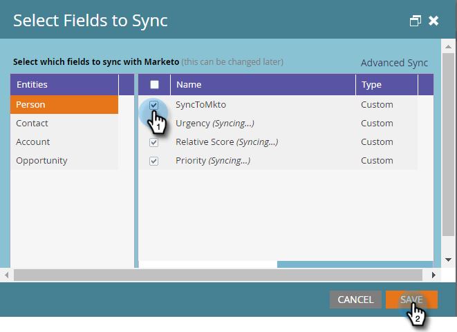

# Steg 3 av 3: Connect Marketo Dynamics (2016 On Prem/Dynamics 365 On-Premises) {#step-of-connect-marketo-dynamics-on-premises-2016}

>[!PREREQUISITES]
>
>* [Installera Marketo för Microsoft Dynamics 2016/Dynamics 365 On-Premises Step 1 of 3](/help/marketo/product-docs/crm-sync/microsoft-dynamics-sync/sync-setup/microsoft-dynamics-2016-dynamics-365-on-premises/step-1-of-3-install.md)
>* [Installera Marketo för Microsoft Dynamics 2016/Dynamics 365 On-Premises Step 2 of 3](/help/marketo/product-docs/crm-sync/microsoft-dynamics-sync/sync-setup/microsoft-dynamics-2016-dynamics-365-on-premises/step-2-of-3-set-up.md)

>[!NOTE]
>
>**Administratörsbehörigheter krävs**

## Ange användarinformation för Dynamics Sync {#enter-dynamics-sync-user-information}

1. Logga in på Marketo och klicka **Administratör**.

   

1. Klicka **CRM**.

   

1. Välj **Microsoft**.

   

1. Klicka **Redigera** in **Steg 1: Ange autentiseringsuppgifter**.

   

   >[!CAUTION]
   >
   >Kontrollera att dina autentiseringsuppgifter är korrekta eftersom det inte går att återställa efterföljande schemaändringar efter överföringen. Om felaktiga uppgifter sparas måste du skaffa en ny Marketo-prenumeration.

1. Ange **Användarnamn**, **Lösenord** en Microsoft Dynamics **URL** och en **Klient-ID/hemlighet**. Klicka **Spara** när det är klart.

   

   >[!NOTE]
   >
   >* Om din Marketo etablerades före oktober 2020 är klient-ID och hemlighet valfria fält. Annars är de obligatoriska. Hur du får den här informationen beror på vilken version av MSD du använder.
   >* Användarnamnet i Marketo måste matcha användarnamnet för synkroniseringsanvändaren i CRM. Formatet kan vara `user@domain.com` eller DOMÄN\användare.
   >* Om du inte känner till URL:en [lära dig hur du hittar det här](/help/marketo/product-docs/crm-sync/microsoft-dynamics-sync/sync-setup/view-the-organization-service-url.md).

   >[!TIP]
   >
   >Vet du inte URL:en? Vi visar dig hur du hittar [URL för Dynamics-organisationstjänst](/help/marketo/product-docs/crm-sync/microsoft-dynamics-sync/sync-setup/view-the-organization-service-url.md) här.

## Markera fält som ska synkroniseras {#select-fields-to-sync}

1. Klicka **Redigera** in **Steg 2: Markera fält som ska synkroniseras**.

   

1. Markera de fält som du vill synkronisera till Marketo så att de är förmarkerade. Klicka **Spara**.

   

>[!NOTE]
>
>Marketo lagrar en referens till de fält som ska synkroniseras. Om du tar bort ett fält i Dynamics rekommenderar vi att du gör det med [synkronisering inaktiverad](/help/marketo/product-docs/crm-sync/salesforce-sync/enable-disable-the-salesforce-sync.md). Uppdatera sedan schemat i Marketo genom att redigera och spara [Markera fält som ska synkroniseras](/help/marketo/product-docs/crm-sync/microsoft-dynamics-sync/microsoft-dynamics-sync-details/microsoft-dynamics-sync-field-sync/editing-fields-to-sync-before-deleting-them-in-dynamics.md).

## Synkronisera fält för ett eget filter {#sync-fields-for-a-custom-filter}

Om du har skapat ett eget filter måste du gå in och välja de nya fält som ska synkroniseras med Marketo.

1. Gå till Admin och välj **Microsoft Dynamics**.

   

1. Klicka **Redigera** i Fältsynkroniseringsinformation.

   

1. Rulla ned till fältet och kontrollera det. Det faktiska namnet måste vara new_synctomkto, men visningsnamnet kan vara vad som helst. Klicka **Spara**.

   

## Aktivera synkronisering {#enable-sync}

1. Klicka **Redigera** in **Steg 3: Aktivera synkronisering**.

   

   >[!CAUTION]
   >
   >Marketo avlastar inte automatiskt mot en Microsoft Dynamics-synkronisering eller när du anger personer manuellt.

1. Läs allt i popup-fönstret, ange din e-postadress och klicka på **Starta synkronisering**.

   

1. Den första synkroniseringen kan ta några timmar. När det är klart får du ett e-postmeddelande.

   

Utmärkt arbete!
