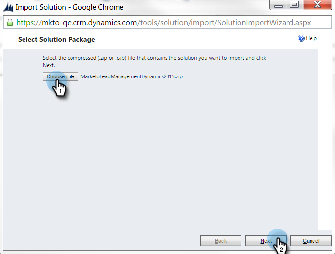

# Steg 1 av 4: Installera Marketo Solution med Resource Owner Password Control Connection {#step-1-of-4-install-the-marketo-solution-ropc}

Innan du kan synkronisera Microsoft Dynamics 365 och Marketo måste du först installera Marketo-lösningen i Dynamics. **Administratörsbehörigheter för Dynamics krävs.**

>[!CAUTION]
>
>* Aktivera inte anpassad entitetssynkronisering innan den inledande synkroniseringen har slutförts. Du meddelas via e-post när den första synkroniseringen är klar.
>* Om Multi-Factor Authentication (MFA) är aktiverat för Dynamics Sync måste du inaktivera det för att Dynamics ska kunna synkroniseras korrekt med Marketo. Mer information får du av [Marketo Support](https://nation.marketo.com/t5/Support/ct-p/Support).

>[!NOTE]
>
>När du har synkroniserat Marketo till en CRM kan du inte utföra en ny synkronisering utan att ersätta instansen.

>[!PREREQUISITES]
>
>[Ladda ned Marketo Lead Management Solution](/help/marketo/product-docs/crm-sync/microsoft-dynamics-sync/sync-setup/download-the-marketo-lead-management-solution.md)

1. Logga in på **[Microsoft Office 365](https://login.microsoftonline.com/)**.

   

1. Klicka  meny och välj **CRM**.

   

1. Klicka  -menyn. Välj **Inställningar** välj **Lösningar**.

   

1. Klicka **Importera.**

   

1. Klicka **Välj Arkiv.** Välj den Marketo Lead Management-lösning du använder [nedladdad](/help/marketo/product-docs/crm-sync/microsoft-dynamics-sync/sync-setup/download-the-marketo-lead-management-solution.md). Klicka **Nästa**.

   

1. Visa lösningsinformationen och klicka på **Visa information om lösningspaket**.

   

1. När du är klar med kontrollen av all information klickar du på **Stäng**.

   

1. Gå tillbaka till sidan Lösningsinformation och klicka på **Nästa**.

   

1. Kontrollera att kryssrutan för SDK-alternativet är markerad. Klicka **Importera**.

   

   >[!TIP]
   >
   >Du måste aktivera popup-fönster i webbläsaren för att slutföra installationen.

1. Vänta nu tills importen är klar. Ställ dig upp och sträck lite.

   

1. Klicka **Stäng.**

   >[!NOTE]
   >
   >Du kan se ett meddelande med texten&quot;Marketo Lead Management har slutförts med varning&quot;. Detta är helt förväntat.

   

1. Marketo Lead Management visas nu i listan över lösningar.

   

1. Välj **Marketo Lead Management** och klicka **Publicera alla anpassningar.**

   

   Hög fem! Installationen är klar.

   >[!MORELIKETHIS]
   >
   >[Steg 2 av 4: Konfigurera Marketo Solution med Resource Owner Password Control Connection](/help/marketo/product-docs/crm-sync/microsoft-dynamics-sync/sync-setup/microsoft-dynamics-365-with-ropc-connection/step-2-of-4-set-up.md)
