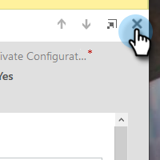

# Steg 2 av 3: Konfigurera Marketo Solution med Resource Owner Password Control Connection {#step-2-of-3-set-up-the-marketo-solution-ropc}

Vi börjar med att skapa ett användarkonto.

>[!PREREQUISITES]
>
>[Steg 1 av 4: Installera Marketo Solution med Resource Owner Password Control Connection](/help/marketo/product-docs/crm-sync/microsoft-dynamics-sync/sync-setup/microsoft-dynamics-365-with-ropc-connection/step-1-of-4-install.md)

## Skapa en ny användare {#create-a-new-user}

1. Logga in i Dynamics. Klicka på ikonen Inställningar och välj **Avancerade inställningar**.

   

1. Klicka **Inställningar** och markera **Säkerhet**.

   

1. Klicka **Användare**.

   

1. Klicka **Nytt.**

   

1. Klicka **Lägg till och licensiera användare** i det nya fönstret.

   

1. En ny flik öppnas. Klicka **Administratör** överst på sidan.

   

1. En annan ny flik öppnas. Klicka **Lägg till en användare**.

   

1. Ange all information. När du är klar klickar du på **Lägg till**.

   

   >[!NOTE]
   >
   >Det här namnet måste vara en dedikerad synkroniseringsanvändare och inte en befintlig CRM-användares konto. Det behöver inte vara en faktisk e-postadress.

1. Ange e-postadressen som ska ta emot inloggningsuppgifterna och klicka på **Skicka e-post och stäng**.

   

## Tilldela synkroniseringsanvändarroll {#assign-sync-user-role}

Tilldela endast Marketo Sync User-rollen till Marketo sync-användaren. Du behöver inte tilldela den till andra användare.

>[!NOTE]
>
>Detta gäller Marketo version 4.0.0.14 och senare. I tidigare versioner måste alla användare ha synkroniseringsanvändarrollen. Om du vill uppgradera Marketo går du till [Uppgradera Marketo Solution för Microsoft Dynamics](/help/marketo/product-docs/crm-sync/microsoft-dynamics-sync/sync-setup/update-the-marketo-solution-for-microsoft-dynamics.md).

>[!IMPORTANT]
>
>Språkinställningen för Synkronisera användare [ska anges till engelska](https://portal.dynamics365support.com/knowledgebase/article/KA-01201/en-us).

1. Gå tillbaka till fliken Aktiverade användare och uppdatera användarlistan.

   

1. Hovra bredvid den nya Marketo Sync-användaren så visas en kryssruta. Klicka för att markera den.

   

1. Klicka **Hantera roller**.

   

1. Kontrollera **Marketo Sync User** och klicka **OK**.

   

   >[!NOTE]
   >
   >Alla uppdateringar som görs i CRM av Synkronisera användare kommer att **not** synkas tillbaka till Marketo.

## Konfigurera Marketo Solution {#configure-marketo-solution}

Nästan klart! Allt vi har kvar är att informera Marketo Solution om den nya användaren som har skapats.

1. Gå tillbaka till avsnittet Avancerade inställningar och klicka på  -ikon bredvid Inställningar och välj **Marketo Config**.

   

   >[!NOTE]
   >
   >Om du inte ser **Marketo Config** Uppdatera sidan på menyn Inställningar. Om det inte fungerar, försök [publicera Marketo Solution](/help/marketo/product-docs/crm-sync/microsoft-dynamics-sync/sync-setup/microsoft-dynamics-365-with-ropc-connection/step-1-of-4-install.md) igen eller logga ut och in igen.

1. Klicka **Standard**.

   

1. Klicka på sökknappen på **Marketo-användare** och välj den synkroniseringsanvändare du skapade.

   

1. Klicka på  i det nedre högra hörnet om du vill spara ändringarna.

   

1. Klicka på **X** i det övre högra hörnet för att stänga skärmen.

   

1. Klicka på  -ikon bredvid Inställningar och välj **Lösningar**.

   

1. Klicka på **Publicera alla anpassningar** -knappen.

   

## Innan du fortsätter till steg 3 {#before-proceeding-to-step}

* Om du vill begränsa antalet poster som du synkroniserar, [konfigurera ett eget synkroniseringsfilter](/help/marketo/product-docs/crm-sync/microsoft-dynamics-sync/create-a-custom-dynamics-sync-filter.md) nu.
* Kör [Validera Microsoft Dynamics Sync](/help/marketo/product-docs/crm-sync/microsoft-dynamics-sync/sync-setup/validate-microsoft-dynamics-sync.md) -processen. Den verifierar att dina initiala inställningar har gjorts korrekt.
* Logga in i Marketo Sync User i Microsoft Dynamics CRM.

   >[!MORELIKETHIS]
   >
   >[Steg 3 av 4: Anslut Marketo Solution med Resource Owner Password Control Connection](/help/marketo/product-docs/crm-sync/microsoft-dynamics-sync/sync-setup/microsoft-dynamics-365-with-ropc-connection/step-3-of-4-set-up.md)
