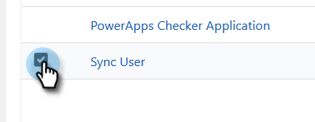

# Steg 2 av 4: Konfigurera Marketo Solution med Resource Owner Password Control Connection {#step-2-of-4-set-up-the-marketo-solution-ropc}

Vi börjar med att skapa ett användarkonto.

>[!PREREQUISITES]
>
>[Steg 1 av 4: Installera Marketo-lösningen med Resursägarens lösenordskontrollanslutning](/help/marketo/product-docs/crm-sync/microsoft-dynamics-sync/sync-setup/microsoft-dynamics-365-with-ropc-connection/step-1-of-4-install.md){target="_blank"}

## Skapa en ny användare {#create-a-new-user}

1. Logga in på [!DNL Dynamics]. Klicka på ikonen [!UICONTROL Settings] och välj **[!UICONTROL Advanced Settings]**.

   

1. Klicka på **[!UICONTROL Settings]** och välj **[!UICONTROL Security]**.

   

1. Klicka på **[!UICONTROL Users]**.

   

1. Klicka på **[!UICONTROL New]**.

   

1. Klicka på **[!UICONTROL Add and License Users]** i det nya fönstret.

   

1. En ny flik öppnas. Klicka på **[!UICONTROL Admin]** överst på sidan.

   

1. En annan ny flik öppnas. Klicka på **[!UICONTROL Add a user]**.

   

   >[!IMPORTANT]
   >
   >Synkroniseringsanvändaren bör ha läsbehörighet för Marketo Config.

1. Ange all information. När du är klar klickar du på **[!UICONTROL Add]**.

   

   >[!NOTE]
   >
   >Det här namnet måste vara en dedikerad synkroniseringsanvändare och inte en befintlig CRM-användares konto. Det behöver inte vara en faktisk e-postadress.

1. Ange e-postadressen som ska ta emot inloggningsuppgifterna och klicka på **[!UICONTROL Send email and close]**.

   

## Tilldela synkroniseringsanvändarroll {#assign-sync-user-role}

Tilldela endast Marketo Sync User-rollen till Marketo sync-användaren. Du behöver inte tilldela den till andra användare.

>[!NOTE]
>
>Detta gäller för Marketo version 4.0.0.14 och senare. I tidigare versioner måste alla användare ha synkroniseringsanvändarrollen. Mer information om hur du uppgraderar Marketo finns i [Uppgradera Marketo-lösning för [!DNL Microsoft Dynamics]](/help/marketo/product-docs/crm-sync/microsoft-dynamics-sync/sync-setup/update-the-marketo-solution-for-microsoft-dynamics.md).

>[!IMPORTANT]
>
>Språkinställningen för synkroniseringsanvändaren [ ska anges till engelska](https://learn.microsoft.com/en-us/power-platform/admin/enable-languages){target="_blank"}.

1. Gå tillbaka till fliken [!UICONTROL Enabled Users] och uppdatera användarlistan.

   

1. Hovra bredvid den nya Marketo Sync-användaren så visas en kryssruta. Klicka för att markera den.

   

1. Klicka på **[!UICONTROL Manage Roles]**.

   

1. Markera **[!UICONTROL Marketo Sync User]** och klicka på **[!UICONTROL OK]**.

   

   >[!NOTE]
   >
   >Alla uppdateringar som görs i CRM av Synkronisera användare _synkroniseras inte_ tillbaka till Marketo.

## Konfigurera Marketo Solution {#configure-marketo-solution}

Nästan klart! Allt vi har kvar är att informera Marketo Solution om den nya användaren som har skapats.

1. Gå tillbaka till avsnittet [!UICONTROL Advanced Settings], klicka på ikonen  intill [!UICONTROL Settings] och välj **[!UICONTROL Marketo Config]**.

   

   >[!NOTE]
   >
   >Uppdatera sidan om du inte ser **[!UICONTROL Marketo Config]** på menyn [!UICONTROL Settings]. Om det inte fungerar kan du försöka med att [publicera Marketo Solution](/help/marketo/product-docs/crm-sync/microsoft-dynamics-sync/sync-setup/microsoft-dynamics-365-with-ropc-connection/step-1-of-4-install.md) igen eller logga ut och in igen.

1. Klicka på **[!UICONTROL Default]**.

   

1. Klicka på sökknappen i fältet **[!UICONTROL Marketo User]** och välj den synkroniseringsanvändare du skapade.

   

1. Klicka på ikonen  längst ned till höger för att spara ändringarna.

   

1. Klicka på **X** i det övre högra hörnet för att stänga skärmen.

   

1. Klicka på ikonen  bredvid [!UICONTROL Settings] och välj **[!UICONTROL Solutions]**.

   

1. Klicka på knappen **[!UICONTROL Publish All Customizations]**.

   

>[!MORELIKETHIS]
>
>[Steg 3 av 4: Anslut Marketo-lösningen med Resursägarens lösenordskontrollanslutning](/help/marketo/product-docs/crm-sync/microsoft-dynamics-sync/sync-setup/microsoft-dynamics-365-with-ropc-connection/step-3-of-4-set-up.md){target="_blank"}
