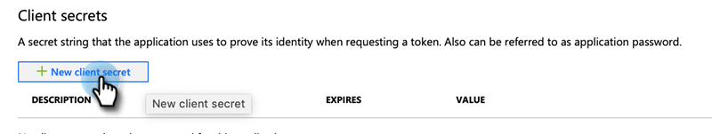

# Steg 3 av 4: Konfigurera klientapp på MS [!DNL Dynamics] {#step-3-of-4-set-up-client-app-ms-dynamics-ropc}

>[!PREREQUISITES]
>
>* [Steg 1 av 4: Installera Marketo-lösningen med Resursägarens lösenordskontrollanslutning](/help/marketo/product-docs/crm-sync/microsoft-dynamics-sync/sync-setup/microsoft-dynamics-365-with-ropc-connection/step-1-of-4-install.md){target="_blank"}
>* [Steg 2 av 4: Konfigurera Marketo-lösningen med Resursägarens lösenordskontrollanslutning](/help/marketo/product-docs/crm-sync/microsoft-dynamics-sync/sync-setup/microsoft-dynamics-365-with-ropc-connection/step-2-of-4-set-up.md){target="_blank"}

1. Navigera till den här [Microsoft-artikeln](https://docs.microsoft.com/en-us/powerapps/developer/common-data-service/walkthrough-register-app-azure-active-directory#create-an-application-registration){target="_blank"}.

1. Följ alla steg. I steg 3 anger du ett relevant programnamn (t.ex. [!DNL Marketo Integration]). Välj Konto endast i den här organisationskatalogen under Kontotyper som stöds.

1. Skriv ned program-ID (ClientId). Du måste ange det i Marketo senare.

1. Ge administratörens samtycke genom att följa stegen i [den här artikeln](/help/marketo/product-docs/crm-sync/microsoft-dynamics-sync/sync-setup/grant-consent-for-client-id-and-app-registration.md){target="_blank"}.

1. Skapa en klienthemlighet i Admin Center genom att klicka på **[!UICONTROL Certificates & secrets]**.

   

1. Klicka på **[!UICONTROL New client secret]**.

   

1. Lägg till en beskrivning av klienthemlighet och klicka på **[!UICONTROL Add]**.

   

   >[!CAUTION]
   >
   >Observera värdet för Klienthemlighet (visas i skärmbilden nedan), som du behöver det senare. Den visas bara en gång och du kommer inte att kunna hämta den igen.

   

## [!DNL Azure AD] Federated med [!DNL AD FS On-prem] {#azure-ad-federated-with-ad-fs-on-prem}

Federated [!DNL Azure] AD till [!DNL ADFS Onprem] måste skapa en identifieringsprincip för Home Realm för det specifika programmet. Med den här principen dirigerar [!DNL Azure] AD om autentiseringsbegäran till federationstjänsten. Synkronisering av lösenordshash måste aktiveras i [!DNL AD Connect] för detta. Mer information finns i [[!DNL OAuth] med [!DNL ROPC]](https://docs.microsoft.com/en-us/azure/active-directory/develop/v2-oauth-ropc) och [Ange en tredje princip för ett program](https://docs.microsoft.com/en-us/azure/active-directory/manage-apps/configure-authentication-for-federated-users-portal#example-set-an-hrd-policy-for-an-application).

Ytterligare referenser [finns här](https://docs.microsoft.com/en-us/azure/active-directory/reports-monitoring/concept-all-sign-ins#:~:text=Interactive%20user%20sign%2Dins%20are,as%20the%20Microsoft%20Authenticator%20app.&text=Denna%20rapport%20innehåller även%20federerade%20är%20federerade%20till%20Azure%20AD.){target="_blank"}.

## Innan du fortsätter till steg 4 {#before-proceeding-to-step-4}

* Om du vill begränsa antalet poster som du synkroniserar konfigurerar [ett anpassat synkroniseringsfilter](/help/marketo/product-docs/crm-sync/microsoft-dynamics-sync/create-a-custom-dynamics-sync-filter.md) nu.
* Kör [Verifiera [!DNL Microsoft Dynamics] synkroniseringsprocessen](/help/marketo/product-docs/crm-sync/microsoft-dynamics-sync/sync-setup/validate-microsoft-dynamics-sync.md). Den verifierar att dina initiala inställningar har gjorts korrekt.
* Logga in på Marketo Sync User i [!DNL Microsoft Dynamics] CRM.

>[!MORELIKETHIS]
>
>* [Steg 4 av 4: Anslut Marketo-lösningen med Resursägarens lösenordskontrollanslutning](/help/marketo/product-docs/crm-sync/microsoft-dynamics-sync/sync-setup/microsoft-dynamics-365-with-ropc-connection/step-4-of-4-connect.md){target="_blank"}
