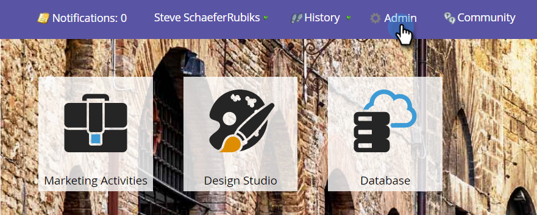

# Steg 4 av 4: Anslut Marketo Solution med Resource Owner Password Control Connection {#step-4-of-4-connect-the-marketo-solution-ropc}

Detta är det sista steget i synkroniseringen. Du är nästan framme!

>[!PREREQUISITES]
>
>* [Steg 1 av 4: Installera Marketo-lösningen med Resursägarens lösenordskontrollanslutning](/help/marketo/product-docs/crm-sync/microsoft-dynamics-sync/sync-setup/microsoft-dynamics-365-with-ropc-connection/step-1-of-4-install.md)
>* [Steg 2 av 4: Konfigurera Marketo-lösningen med Resursägarens lösenordskontrollanslutning](/help/marketo/product-docs/crm-sync/microsoft-dynamics-sync/sync-setup/microsoft-dynamics-365-with-ropc-connection/step-2-of-4-set-up.md)
>* [Steg 3 av 4: Konfigurera klientapp på MS [!DNL Dynamics]](/help/marketo/product-docs/crm-sync/microsoft-dynamics-sync/sync-setup/microsoft-dynamics-365-with-ropc-connection/step-3-of-4-set-up.md)

>[!NOTE]
>
>**Administratörsbehörigheter krävs**

>[!NOTE]
>
>Om du uppgraderar från grundläggande autentisering till [!DNL OAuth] kan du använda [den här artikeln](/help/marketo/product-docs/crm-sync/microsoft-dynamics-sync/sync-setup/reconfigure-dynamics-authentication-method.md) för att konfigurera om din autentisering.

## Ange [!DNL Dynamics] synkroniseringsanvändarinformation {#enter-dynamics-sync-user-information}

1. Logga in på Marketo och klicka på **[!UICONTROL Admin]**.

   

1. Klicka på **[!UICONTROL CRM]**.

   

1. Välj **[!UICONTROL Microsoft]**.

   

1. Klicka på **[!UICONTROL Edit]** i **[!UICONTROL Step 1: Enter Credentials]**.

   

   >[!CAUTION]
   >
   >Kontrollera att din organisations-URL är korrekt eftersom det inte går att återställa efterföljande schemaändringar efter överföringen. Om en felaktig Org URL används måste du skaffa en ny Marketo-prenumeration. Om du inte känner till URL:en kan du [lära dig att hitta den här](/help/marketo/product-docs/crm-sync/microsoft-dynamics-sync/sync-setup/view-the-organization-service-url.md){target="_blank"}.

   >[!NOTE]
   >
   >Innan du anger nya autentiseringsuppgifter kan du [validera dem här](/help/marketo/product-docs/crm-sync/microsoft-dynamics-sync/sync-setup/validate-microsoft-dynamics-sync.md){target="_blank"}.

1. Ange **[!UICONTROL Username]**, **[!UICONTROL Password]**, [!DNL Microsoft Dynamics] **[!UICONTROL URL]**, **[!UICONTROL Client ID]** och **[!UICONTROL Client Secret]**. Klicka på **[!UICONTROL Save]** när du är klar.

   

   >[!NOTE]
   >
   >Användarnamnet i Marketo måste matcha användarnamnet för synkroniseringsanvändaren i CRM. Formatet kan vara `user@domain.com` eller DOMÄN\användare.

## Markera fält som ska synkroniseras {#select-fields-to-sync}

1. Klicka på **[!UICONTROL Edit]** i **[!UICONTROL Step 2: Select Fields to Sync]**.

   

1. Markera de fält som du vill synkronisera till Marketo så att de är förmarkerade. Klicka på **[!UICONTROL Save]**.

   

>[!NOTE]
>
>Marketo lagrar en referens till de fält som ska synkroniseras. Om du tar bort ett fält i [!DNL Dynamics] rekommenderar vi att du gör det med [synkroniseringen inaktiverad](/help/marketo/product-docs/crm-sync/salesforce-sync/enable-disable-the-salesforce-sync.md). Uppdatera sedan schemat i Marketo genom att redigera och spara [Markera fält som ska synkroniseras](/help/marketo/product-docs/crm-sync/microsoft-dynamics-sync/microsoft-dynamics-sync-details/microsoft-dynamics-sync-field-sync/editing-fields-to-sync-before-deleting-them-in-dynamics.md).

## Synkronisera fält för ett eget filter {#sync-fields-for-a-custom-filter}

Om du har skapat ett eget filter måste du gå in och välja de nya fält som ska synkroniseras med Marketo.

1. Gå till [!UICONTROL Admin] och välj **[!UICONTROL Microsoft Dynamics]**.

   

1. Klicka på **[!UICONTROL Edit]** på [!UICONTROL Field Sync Details].

   

1. Rulla ned till fältet och kontrollera det. Det faktiska namnet måste vara new_synctomkto, men visningsnamnet kan vara vad som helst. Klicka på **[!UICONTROL Save]**.

   

## Aktivera synkronisering {#enable-sync}

1. Klicka på **[!UICONTROL Edit]** i **[!UICONTROL Step 3: Enable Sync]**.

   

   >[!CAUTION]
   >
   >Marketo avduplicerar inte automatiskt mot en [!UICONTROL Microsoft Dynamics]-synkronisering eller när du anger personer eller leads manuellt.

1. Läs allt i popup-fönstret, ange din e-postadress och klicka på **[!UICONTROL Start Sync]**.

   

1. Beroende på antalet poster kan den inledande synkroniseringen ta från några timmar till några dagar var som helst. Du får ett e-postmeddelande när du är klar.

   

>[!MORELIKETHIS]
>
>[Konfigurera om [!DNL Dynamics] autentiseringsmetod](/help/marketo/product-docs/crm-sync/microsoft-dynamics-sync/sync-setup/reconfigure-dynamics-authentication-method.md)
