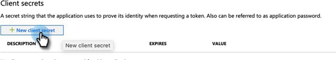

# Steg 2 av 3: Konfigurera Marketo Solution med Server to Server Connection {#step-2-of-3-set-up-marketo-sync-user-in-dynamics-s2s}

>[!PREREQUISITES]
>
>[Steg 1 av 3: Installera Marketo Solution with Server to Server Connection](/help/marketo/product-docs/crm-sync/microsoft-dynamics-sync/sync-setup/microsoft-dynamics-365-with-s2s-connection/step-1-of-3-install.md)

## Skapa klientprogram i Azure AD {#create-client-application-in-azure-ad}

1. Navigera till [den här Microsoft-artikeln](https://docs.microsoft.com/en-us/powerapps/developer/common-data-service/walkthrough-register-app-azure-active-directory#create-an-application-registration).

1. Följ alla steg. I steg 3 anger du ett relevant programnamn (t.ex.&quot;Marketo Integration&quot;). Under de kontotyper som stöds väljer du **Konto endast i den här organisationskatalogen**.

1. Skriv ned program-ID (ClientId) och klient-ID. Du måste ange det i Marketo senare.

1. Ge administratörens samtycke genom att följa stegen [i den här artikeln](/help/marketo/product-docs/crm-sync/microsoft-dynamics-sync/sync-setup/grant-consent-for-client-id-and-app-registration.md).

1. Generera en klienthemlighet i Admin Center genom att klicka på **Certifikat och hemligheter**.

   

1. Klicka på **Ny klienthemlighet** -knappen.

   

1. Ange en beskrivning av klienthemligheten och klicka på **Lägg till**.

   

>[!CAUTION]
>
>Observera värdet för Klienthemlighet (visas i skärmbilden nedan), som du behöver det senare. Den visas bara en gång och du kommer inte att kunna hämta den igen.

1. Följ stegen från följande länk för att [konfigurera en programanvändare i Microsoft](https://docs.microsoft.com/en-us/powerapps/developer/common-data-service/use-single-tenant-server-server-authentication#application-user-creation). När du ger behörighet till programanvändaren tilldelar du den till&quot;Marketo Sync User Role&quot;.

## Azure AD Federated med AD FS On-prem {#azure-ad-federated-with-ad-fs-on-prem}

Federated Azure AD till ADFS OnPrem måste skapa en identifieringsprincip för hemsfär för det specifika programmet. Med den här principen dirigerar Azure AD om autentiseringsbegäran till federationstjänsten. Synkronisering av lösenordshash måste aktiveras i AD Connect för detta. Mer information finns på [OAuth med ROPC](https://docs.microsoft.com/en-us/azure/active-directory/develop/v2-oauth-ropc) och [Ange en tredje princip för ett program](https://docs.microsoft.com/en-us/azure/active-directory/manage-apps/configure-authentication-for-federated-users-portal#example-set-an-hrd-policy-for-an-application).

Ytterligare referenser [finns här](https://docs.microsoft.com/en-us/azure/active-directory/reports-monitoring/concept-all-sign-ins#:~:text=Interactive%20user%20sign%2Dins%20are,as%20the%20Microsoft%20Authenticator%20app.&amp;text=Denna%20rapport%20innehåller även%20federerade%20är%20federerade%20till%20Azure%20AD.).

## Tilldela synkroniseringsanvändarroll {#assign-sync-user-role}

1. Tilldela endast Marketo Sync User-rollen till Marketo Sync-användare.

>[!NOTE]
>
>Detta gäller Marketo version 4.0.0.14 och senare. I tidigare versioner måste alla användare ha synkroniseringsanvändarrollen. För att uppgradera din Marketo-lösning [se den här artikeln](/help/marketo/product-docs/crm-sync/microsoft-dynamics-sync/sync-setup/update-the-marketo-solution-for-microsoft-dynamics.md).

1. Gå tillbaka till fliken Programanvändare och uppdatera användarlistan.

   

1. Hovra bredvid den nyskapade programanvändaren så visas en kryssruta. Klicka för att markera den.

   

1. Klicka **Hantera roller**.

   

1. Kontrollera **Marketo Sync User** och klicka **OK**.

   

## Konfigurera Marketo Solution {#configure-marketo-solution}

Nästan klart! Allt vi har kvar är att informera Marketo Solution om den nya användaren som har skapats.

>[!IMPORTANT]
>
>Om du uppgraderar från grundläggande autentisering till OAuth måste du kontakta [Marketo Support](https://nation.marketo.com/t5/support/ct-p/Support) om du vill ha hjälp med att uppdatera ytterligare parametrar. Om du aktiverar den här funktionen avbryts synkroniseringen tillfälligt tills nya autentiseringsuppgifter anges och synkroniseringen aktiveras igen. Funktionen kan inaktiveras (fram till april 2022) om du vill återgå till det gamla autentiseringsläget.

1. Gå tillbaka till avsnittet Avancerade inställningar och klicka på  -ikon bredvid Inställningar och välj **Marketo Config**.

   

   >[!NOTE]
   >
   >Om du inte ser **Marketo Config** Uppdatera sidan på menyn Inställningar. Om det inte fungerar, försök [publicera Marketo Solution](/help/marketo/product-docs/crm-sync/microsoft-dynamics-sync/sync-setup/microsoft-dynamics-365-with-s2s-connection/step-1-of-3-install.md) igen eller logga ut och in igen.

1. Klicka **Standard**.

   

1. Klicka på sökknappen på **Marketo-användare** och välj den synkroniseringsanvändare du skapade.

   

1. Klicka på  i det nedre högra hörnet om du vill spara ändringarna.

   

1. Klicka på **X** i det övre högra hörnet för att stänga skärmen.

   

1. Klicka på  -ikon bredvid Inställningar och välj **Lösningar**.

   

1. Klicka på **Publicera alla anpassningar** -knappen.

   

## Innan du fortsätter till steg 3 {#before-proceeding-to-step}

* Om du vill begränsa antalet poster som du synkroniserar, [konfigurera ett eget synkroniseringsfilter](/help/marketo/product-docs/crm-sync/microsoft-dynamics-sync/create-a-custom-dynamics-sync-filter.md) nu.
* Kör [Validera Microsoft Dynamics Sync](/help/marketo/product-docs/crm-sync/microsoft-dynamics-sync/sync-setup/validate-microsoft-dynamics-sync.md) -processen. Den verifierar att dina initiala inställningar har gjorts korrekt.
* Logga in på Marketo Sync User i Microsoft Dynamics CRM.

>[!MORELIKETHIS]
>
>[Steg 3 av 3: Ansluta Marketo-lösningen med server-till-server-anslutning](/help/marketo/product-docs/crm-sync/microsoft-dynamics-sync/sync-setup/microsoft-dynamics-365-with-s2s-connection/step-3-of-3-connect.md)
