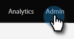
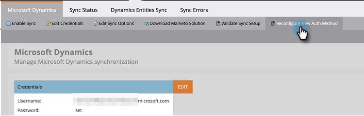

# Konfigurera om Dynamics-autentiseringsmetod {#reconfigure-dynamics-authentication-method}

Följ stegen nedan för att uppdatera din Dynamics-autentiseringsmetod.

>[!PREREQUISITES]
>
>Konfigurera programmet i Microsoft Dynamics och den aktiva katalogen (Azure AD/ADFS) med önskad autentiseringsmetod från någon av följande artiklar:
>
>* [Steg 2 av 3: Konfigurera Marketo Solution med Server to Server Connection](/help/marketo/product-docs/crm-sync/microsoft-dynamics-sync/sync-setup/microsoft-dynamics-365-with-s2s-connection/step-2-of-3-set-up.md)
>* [Steg 2 av 4: Konfigurera Marketo Solution med Resource Owner Password Control Connection](/help/marketo/product-docs/crm-sync/microsoft-dynamics-sync/sync-setup/microsoft-dynamics-365-with-ropc-connection/step-2-of-4-set-up.md)

1. I Marketo klickar du **Administratör**.

   

1. Klicka **Microsoft Dynamics** sedan **Inaktivera synkronisering**.

   

   >[!NOTE]
   >
   >Du måste inaktivera den globala synkroniseringen tillfälligt för att kunna uppdatera autentiseringsmetoden.

1. Klicka på **Konfigurera om ny autentiseringsmetod** -fliken.

   

1. Välj önskad ny autentiseringsmetod (i det här exemplet väljer vi webb-API).

   

1. Ange de autentiseringsuppgifter som krävs för den nya autentiseringsmetoden och klicka på **Validera**.

   

   >[!NOTE]
   >
   >* De specifika fälten varierar beroende på vald autentiseringsmetod och formuläret uppdateras automatiskt beroende på föregående autentiseringsmetod.
   >* Om du har synkroniserat tidigare kan data i ovanstående formulär vara förifyllda. Ange alla inloggningsuppgifter igen för att säkerställa rätt värden.

1. Om allt är bra genereras alla gröna bockar i Validera synkronisering . Granska meddelandet och klicka på **Byt** för att uppdatera autentiseringsmetoden.

   

   >[!NOTE]
   >
   >Om du ser en , det steget har ett problem. Se [Åtgärda problem med synkronisering av Dynamics-validering](/help/marketo/product-docs/crm-sync/microsoft-dynamics-sync/sync-setup/validate-microsoft-dynamics-sync/fix-dynamics-validation-sync-issues.md) för att identifiera och åtgärda problem. Kör sedan synkroniseringsvalideringsstegen igen tills resultatet ser ut som bilden ovan.

1. Klicka **Bekräfta** för att fortsätta.

   

1. Klicka **Bekräfta** igen.

   

1. Klicka **OK**.

   >[!IMPORTANT]
   >
   >Det tar 15 minuter att godkänna det nya autentiseringsläget. Vänta 15 minuter från switchtiden innan du aktiverar synkroniseringen igen.
