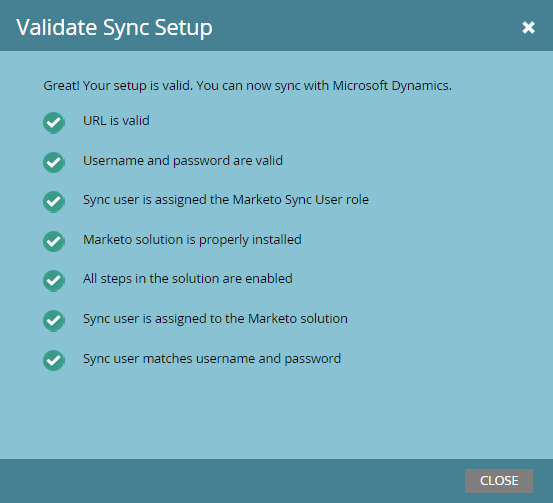

# Åtgärda problem med synkronisering av Dynamics-validering {#fix-dynamics-validation-sync-issues}

## Validera resultat för synkroniseringsverktyget {#validate-sync-tool-results}

När du kör Dynamics Validate Sync genereras den här rapporten. Om det finns en  bredvid ett steg, se nedan för att identifiera och åtgärda problemet. Kör sedan synkroniseringsvalideringsstegen igen tills resultatet inte visar något annat än bockmarkeringar.

## URL:en är giltig {#url-is-valid}

Om du har en  här kontrollerar du att URL:en är giltig. Här hittar du Developer Resources och tittar på Organization Service. URL:en kan vara ogiltig av flera orsaker.

1. Logga in i Dynamics. Klicka på ikonen Inställningar och välj **Avancerade inställningar**.

   

1. Klicka på Inställningar och välj **Anpassningar**.

   

1. Klicka på **Utvecklarresurser**.

   

1. URL:en för organisationstjänsten finns under Tjänstslutpunkter.

   

## Användarnamn och lösenord är giltiga {#username-and-password-are-valid}

Om du har ett  kontrollerar du att ditt Microsoft Dynamics-användarnamn och -lösenord är giltiga.

## Synkroniseringsanvändaren har tilldelats rollen Marketo Sync User {#sync-user-is-assigned-to-the-marketo-sync-user-role}

Om du har en  - här måste du verifiera att rollen Marketo Sync User (Synkronisera användare) är markerad i Microsoft Dynamics. Se steg 2 i installationsdokumentationen för Microsoft Dynamics.

1. Klicka på ikonen Inställningar i Dynamics och välj **Avancerade inställningar**.

   

1. Klicka på **Inställningar** och välj **Dokumentskydd**.

   

1. Klicka på **Användare.**

   

1. Klicka på länken för synkroniseringsanvändaren.

   

1. Klicka på **Hantera roller**.

   

1. Kontrollera att Marketo Sync User-rollen är markerad. Om inte, markerar du den och klickar på **OK.**

   

## Marketo-lösningen är korrekt installerad {#marketo-solution-is-properly-installed}

Om du har en  - här går du till Microsoft Dynamics för att verifiera att Marketo-installationen finns där. Se steg 1 i installationsdokumentationen för Microsoft Dynamics.

1. Klicka på ikonen Inställningar i Dynamics och välj **Avancerade inställningar**.

   

1. Klicka på **Inställningar **och välj **Lösningar.**

   

1. Kontrollera att lösningen finns med i listan.

   

## Alla steg i lösningen är aktiverade {#all-steps-in-the-solution-are-enabled}

Om du har en  kontrollerar du att ingen av standardstegen har inaktiverats. Alla steg aktiveras automatiskt vid installationen, men de kan inaktiveras under en anpassning.

## Synkroniseringsanvändaren har tilldelats Marketo-lösningen {#sync-user-is-assigned-to-the-marketo-solution}

Om du har en  - kontrollerar du att synkroniseringsanvändaren är tilldelad till standardsidan Marketo i Microsoft Dynamics.

1. Klicka på ikonen Inställningar i Dynamics och välj **Avancerade inställningar**.

   

1. Klicka på **Settings **och välj **Marketo Config**.

   

1. Kontrollera att synkroniseringsanvändaren är tilldelad som standard.

   

## Synkronisera användare matchar användarnamn och lösenord {#sync-user-matches-username-and-password}

Om du har en  - se till att tilldela rätt synkroniseringsanvändare i fältet Marketo-användare i steget Marketo Config-standardinställning i Microsoft Dynamics.

>[!NOTE]
>
>**Relaterade artiklar**
>
>[Verifiera Microsoft Dynamics Sync](../../../../../product-docs/crm-sync/microsoft-dynamics-sync/sync-setup/validate-microsoft-dynamics-sync.md)

