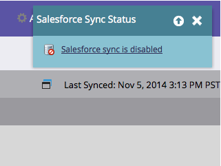

# Aktivera/inaktivera synkroniseringen av [!DNL Salesforce] {#enable-disable-the-salesforce-sync}

När du gör större ändringar i dina synkroniserings- eller fältinställningar bör du inaktivera synkroniseringen medan du konfigurerar. Så här:

1. Gå till avsnittet **[!UICONTROL Admin]**.

   

1. Klicka på **[!UICONTROL Salesforce]** under **[!UICONTROL Disable Sync]**.

   

1. Synkroniseringen på två sätt är nu inaktiverad och inaktiv tills du återaktiverar den. [!DNL Salesforce] flödesåtgärder fortsätter att fungera.

   

1. Gör ändringarna och aktivera synkroniseringen igen. Det är samma knapp.
