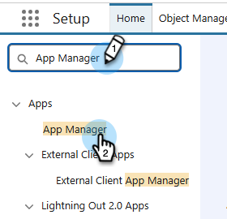

# Logga in med OAuth 2.0 {#log-in-using-oauth-2-0}

Salesforce använder OAuth-protokollet för att tillåta användare av program att på ett säkert sätt få åtkomst till (autentisera programmet med OAuth 2.0) data utan att behöva visa inloggningsuppgifter. Nedan beskrivs de steg som ska utföras för att ansluta och synkronisera Marketo Engage säkert med Salesforce.

>[!IMPORTANT]
>
>Om du vill ansluta Marketo och [!DNL Salesforce] med OAuth loggar du in på Marketo via en privat webbläsare (incognito) för att undvika att ansluta till [!DNL Salesforce] med fel användarnamn.

## Konfigurera externt klientprogram {#set-up-external-client-app}

>[!NOTE]
>
>Från september 2025 började Salesforce begränsa användningen av [anslutna appar](https://help.salesforce.com/s/articleView?id=005132365&type=1){target="_blank"}. För befintliga användare som har konfigurerat en ansluten app baserat på vår dokumentation kan du antingen lägga till behörigheten Godkänn avinstallerade anslutna appar i profilen för Marketo Sync-användaren eller skapa en ny extern klientapp enligt instruktionerna nedan.

1. Klicka på kugghjulsikonen i Salesforce och välj **Inställningar**.

   

1. Skriv `App Manager` i rutan Snabbsökning och välj sedan **App Manager**.

   

1. Klicka på **Ny extern klientapp**.

   

1. Fyll i informationen under _Grundläggande information_. Ange _Distributionsstatus_ till **Lokal**.

   

1. Expandera avsnittet **API (Aktivera OAuth-inställningar)** och markera kryssrutan **[!UICONTROL Enable OAuth]**. Ange _för_&#x200B;Återanrops-URL`https://app.marketo.com/salesforce/getSfdcOAuthTokensRedirect`. Markera alla tillgängliga OAuth-scope och klicka på högerpilen för att lägga till dem.

   

1. Kontrollera att inga rutor är markerade under _Flödesaktivering_.

   

1. Under _Säkerhet_ kontrollerar du att bara **Kräv hemlighet för webbserverflöde** och **Kräv hemlighet för uppdateringstokenflöde** är markerade.

   

1. Hoppa över de fyra sista avsnitten och klicka på **Skapa**.

   

1. När den nya externa klientappen har skapats klickar du på fliken **Inställningar** och expanderar avsnittet **OAuth-inställningar** .

   

1. Klicka på knappen **Konsumentnyckel och konsumenthemlighet** och be en ny flik att öppna. Kopiera och spara båda siffrorna (du behöver dem senare för att använda dem i Marketo Engage).

   

## Konfigurera Marketo {#set-up-marketo}

>[!PREREQUISITES]
>
>* API-åtkomst måste vara aktiverat för Salesforce Sync User (om du är en Salesforce Professional Edition-användare är den åtkomsten inte tillgänglig som standard - kontakta din Salesforce Account Executive).
>* Marketo Sync-användare måste skapas i Salesforce.
>* För befintliga kunder aktiveras funktionen&quot;Aktivera OAuth för SFDC-synkronisering&quot; i kundens prenumeration.
>* Popup-blockerare är inaktiverade.
>* Ansluten app skapas och vi har [!UICONTROL Consumer Key] och [!UICONTROL Consumer Secret] tillgängliga för användning.

>[!CAUTION]
>
>Se till att du döljer alla fält som du inte behöver i Marketo för synkroniseringsanvändaren innan du klickar på **[!UICONTROL Sync Fields]**. När du klickar på Synkronisera fält skapas alla fält som användaren kan se i SFDC permanent i Marketo och kan inte tas bort.

1. Klicka på **[!UICONTROL CRM]** och sedan på **[!UICONTROL Sync with Salesforce]** i avsnittet Marketo Admin.

   

1. Lägg till information om konsumentnyckel och hemlighet som du tidigare spelat in och klicka på och **[!UICONTROL Save]**.

   

1. Klicka på knappen **[!UICONTROL Login with Salesforce]** på synkroniseringssidan för Marketo Salesforce.

   

   >[!CAUTION]
   >
   >Om du ser fält för användarnamn/lösenord/token och inte en inloggningsknapp för Salesforce, aktiveras din Marketo-prenumeration för grundläggande autentisering. Se [Konfigurera Marketo med grundläggande autentisering](/help/marketo/product-docs/crm-sync/salesforce-sync/setup/enterprise-unlimited-edition/step-3-of-3-connect-marketo-and-salesforce-enterprise-unlimited.md){target="_blank"}. När synkroniseringen börjar med en uppsättning inloggningsuppgifter sker ingen växling av Salesforce-inloggningsuppgifter eller -prenumeration. Om du vill att Oauth 2.0 ska vara konfigurerad för din Salesforce-autentisering kontaktar du [Marketo support](https://nation.marketo.com/t5/support/ct-p/Support){target="_blank"}.

1. Ett popup-fönster med inloggningssidan för Salesforce visas. Ange dina Marketo Sync-användaruppgifter och logga in.

   

1. Ange verifieringskoden som du fick via e-post (skickas av Salesforce) och klicka på **[!UICONTROL Verify]**.

   

1. När verifieringen är klar visas åtkomstsidan och begär åtkomst. Klicka på **[!UICONTROL Allow]**.

   

1. Om några minuter visas ett popup-fönster i Marketo. Klicka på **[!UICONTROL Confirm Credentials]**.

   

1. När fältsynkroniseringen är klar klickar du på **[!UICONTROL Start Salesforce Sync]**.

   

1. Klicka på **[!UICONTROL Start Sync]**.

   

Din synkronisering mellan Marketo och [!DNL Salesforce] pågår.

>[!MORELIKETHIS]
>
>* [Steg 1 av 3: Lägg till Marketo-fält i Salesforce (Enterprise/Unlimited)](/help/marketo/product-docs/crm-sync/salesforce-sync/setup/enterprise-unlimited-edition/step-1-of-3-add-marketo-fields-to-salesforce-enterprise-unlimited.md){target="_blank"}
>* [Steg 2 av 3: Skapa en Salesforce-användare för Marketo (Enterprise/Unlimited)](/help/marketo/product-docs/crm-sync/salesforce-sync/setup/enterprise-unlimited-edition/step-2-of-3-create-a-salesforce-user-for-marketo-enterprise-unlimited.md){target="_blank"}
>* [Installera Marketo Sales Insight-paketet i Salesforce AppExchange](/help/marketo/product-docs/marketo-sales-insight/msi-for-salesforce/installation/install-marketo-sales-insight-package-in-salesforce-appexchange.md){target="_blank"}
>* [Konfigurera Marketo Sales Insight i Salesforce Enterprise/Unlimited](/help/marketo/product-docs/marketo-sales-insight/msi-for-salesforce/configuration/configure-marketo-sales-insight-in-salesforce-enterprise-unlimited.md){target="_blank"}
