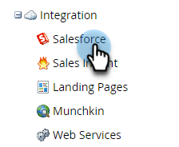

# Salesforce Sync Backlog Metrics  {#salesforce-sync-backlog-metrics}

Synkroniseringens efterlogg är namnet som används för poster som väntar på synkronisering. Den används för poster som väntar på synkronisering från Salesforce till Marketo Engage, och vice versa. Om du ser till att eftersläpningen är under kontroll kommer synkroniseringen att bli smidig och tidssynkroniserad. Eftersläpningen täcker antalet väntande synkroniseringsuppdateringar på båda sidor, och inte de som utförs av synkroniseringsflödessteg som Synkronisera lead till SFDC-flödessteg.

## Åtkomst {#how-to-access}

1. Gå till området **Admin** i Marketo Engage.

   

1. Välj **Salesforce**.

   

## Synkronisera eftersläpning {#sync-backlog-trend}

Trenden för eftersläpning återspeglar förändringar i eftersläpningar som registrerats under de senaste fem dagarna. Eftersläpningen visas i ett 4-timmars tidsintervall som sträcker sig över 5 dagar. Därför kommer diagrammet att visa 6 intervall per dag gånger 5 dagar, vilket motsvarar 30 intervall.

Eftersläpning observeras vid ett visst 4-timmars tidsintervall på x-axeln. Det här värdet gäller för alla objekt som är synkroniserade. Detta är det totala antalet eftersläpningar i Salesforce och Marketo Engage som väntar på att synkroniseras.

## Synkronisera dataflöde och eftersläpning {#sync-throughput-and-backlog}

Statistiken visar genomströmning och eftersläpningsstatus för varje objekttyp som är synkroniserad under de senaste 24 timmarna. Objekttyperna omfattar alla objekt som är synkroniserade, inklusive Lead, Kontakt, Konto, Möjlighet, Kampanj, Användare och Anpassade objekt. Dataflödesstatistiken uppdateras automatiskt var 15:e minut, men du kan uppdatera manuellt med hjälp av uppdateringsikonen. Eftersläpningen hämtas varje timme.

>[!NOTE]
>
>Statistiken uppdateras på rullande basis, inte efter kalenderdag.

<table><thead>
  <tr>
    <th>Fält</th>
    <th>Beskrivning</th>
  </tr></thead>
<tbody>
  <tr>
    <td>Maximalt antal synkroniserade poster / hr</td>
    <td>Det högsta antalet poster som synkroniseras per timme (maximalt dataflöde) som observerats under de senaste 24 timmarna för objekttypen. 24-timmarsperioden är full av tid, inte kalenderdagen.</td>
  </tr>
  <tr>
    <td>Minsta antal synkroniserade poster / hr</td>
    <td>Det minsta antalet poster som synkroniseras per timme (lägsta dataflöde) som observerats under de senaste 24 timmarna för objekttypen. 24-timmarsperioden är full av tid, inte kalenderdagen.</td>
  </tr>
  <tr>
    <td>Genomsnittligt antal synkroniserade poster/timme</td>
    <td>Det genomsnittliga antalet poster som synkroniserats per timme (lägsta dataflöde) som observerats under de senaste 24 timmarna för objekttypen. 24-timmarsperioden är full av tid, inte kalenderdagen. Detta beräknas som det totala antalet poster som synkroniserats under de senaste 24 timmarna.</td>
  </tr>
  <tr>
    <td>Synkronisera eftersläpning</td>
    <td>Eftersläpningen med poster som väntar på synkronisering för objekttypen. Det är den totala summan för eftersläpande synkronisering i båda riktningarna (från Salesforce till Marketo Engage och vice versa). Eftersläpningen från Salesforce hämtas med ett API-anrop till Salesforce, och eftersläpningen från Marketo Engage beräknas med hjälp av statistik från ändringsdataloggen. Detta beräknas varje timme. De två följande fälten i den här tabellen anger när eftersläpningen senast beräknades och nästa schema för beräkning.</td>
  </tr>
  <tr>
    <td>Uppskattad eftersläpning (tid)</td>
    <td>Uppskattning av den tid som krävs för att synkronisera eftersläpningen per objekttyp. Beräknas som "Synkronisera eftersläpning/medel-poster synkroniserade per timme".</td>
  </tr>
  <tr>
    <td>Senast hämtad eftersläpning</td>
    <td>Tidpunkten för den senaste eftersläpningsberäkningen.</td>
  </tr>
  <tr>
    <td>Eftersläpning vid nästa hämtning</td>
    <td>Tidpunkten för nästa eftersläpningsberäkning.</td>
  </tr>
  <tr>
    <td>Status för eftersläpning</td>
    <td>Detta visar om eftersläpningen har växt de senaste sex timmarna. Den betraktas som "Växande" om den nuvarande eftersläpningen är större än den som registrerats för 6 timmar sedan. I annat fall visas det som"Normal". Detta är avsett att visa om synkroniseringens genomströmning håller på att ta igen eftersläpningen.</td>
  </tr>
</tbody></table>

## Vad orsakar synkronisering av eftersläpningar {#what-causes-sync-backlogs}

Oavsett om uppdateringen görs på Marketo Engage eller CRM-sidan kommer den att utlösa att posten synkroniseras igen för att uppdatera informationen på andra sidan genom den vanliga synkroniseringscykeln mellan Marketo Engage och CRM. När en uppdatering görs av en post i Salesforce genereras en tidsstämpel för systemändring, som kallas SysModStamp. Detta medför att en ändring som ska synkroniseras köas.

När en stor mängd uppdateringar görs (till exempel när ett fältvärde ändras) ändras många poster, vilket ger nya SysModStamps. Ett stort antal personregisteruppdateringar måste sedan synkroniseras igen mellan Marketo Engage och CRM, vilket ibland skapar en tillfällig eftersläpning.

## Bästa tillvägagångssätt för hantering av eftersläpningar i synkronisering {#best-practices}

**Fält som är synliga för synkronisering av användare**: Kontrollera att de fält som är synliga för synkronisering endast är de som behöver synkroniseras och har ett värde för marknadsföringsaktiviteter. Alla uppdateringar av en post i Salesforce som uppdaterar den senast ändrade tidsstämpeln placerar posten i kö i efterloggen för synkronisering, och onödig synkronisering av fält kan göra att mer viktiga fält blir långsammare under synkronisering. Om de onödiga fälten döljs för synkroniseringsanvändaren, kommer uppdateringar av dessa fält att resultera i en hoppning som är mycket snabbare än en uppdatering. Arbeta med din Salesforce-administratör för att granska de effektivaste strategierna [här](https://nation.marketo.com/t5/marketo-whisperer-blogs/best-practices-for-determining-which-fields-to-sync-with-marketo/ba-p/247449){target="_blank"} och uppdatera vilka fält som är synliga för Marketo Sync-användaren.

**Dölj eller filtrera bort onödiga poster**: Om en post inte är marknadsmässig kan synkroniseringsresurser gå förlorade. Om synkroniseringsanvändaren inte kan se den, kommer det inte att slösa resurser på att synkronisera den. [Marketo Engage Support](https://nation.marketo.com/t5/support/ct-p/Support#_blank){target="_blank"} kan hjälpa dig att konfigurera ett synkroniseringsfilter för att hindra poster från att synkroniseras baserat på ytterligare kriterier. Mer information om hur du konfigurerar ett anpassat synkroniseringsfilter [finns här](https://nation.marketo.com/t5/product-blogs/instructions-for-creating-a-custom-sync-rule/ba-p/242758){target="_blank"}. Vi rekommenderar starkt att du använder indexfält i Salesforce (kontakta salesforce för mer information).

**Schemalägg massuppdateringar under icke-kritiska timmar**: Granska dina datasynkroniseringsmönster för att identifiera icke-kritiska perioder. Granska om det går att schemalägga satsvisa uppdateringar under dessa icke-kritiska perioder.

**Fält som uppdateras ofta**: Vissa fält har ofta uppdaterats. Till exempel valutafält som är föremål för valutaändringar. Granska om de behöver synkroniseras eller om fälten ska utformas på ett annat sätt. Om du har andra fält som uppdateras ofta och inte behövs döljer du dem för synkroniseringsanvändaren. Diskutera med era SFDC-administratörsintegreringar som kanske uppdaterar fält.

**Anpassade objekt**: Granska [anpassade objekt](https://experienceleague.adobe.com/en/docs/marketo/using/product-docs/crm-sync/salesforce-sync/sfdc-sync-details/sfdc-sync-custom-object-sync){target="_blank"} regelbundet och aktivera synkronisering och inaktivera objekt som inte längre behöver synkroniseras.

**Aktiviteter**: [Granska om några aktiviteter](https://experienceleague.adobe.com/en/docs/marketo/using/product-docs/crm-sync/salesforce-sync/setup/optional-steps/customize-activities-sync){target="_blank"} har aktiverat synkronisering som kan tas bort från synkroniseringen.  De här aktiviteterna synkroniseras bara en gång per dag och lead.

**Granska synkroniseringsfel**: Undantagshantering kan göra synkroniseringen långsammare. Att granska användarmeddelanden och åtgärda fel kan förbättra synkroniseringshälsan.

**Kontakta support**: Kontakta [Marketo Engage Support](https://nation.marketo.com/t5/support/ct-p/Support#_blank){target="_blank"} om du följer alla ovanstående rutiner och fortfarande har betydande eftersläpningar.
