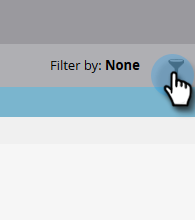

# Salesforce-synkroniseringsfel {#salesforce-sync-errors}

Visa en sammanfattning av de fel som uppstod under synkroniseringsprocessen. Detta inkluderar fel som orsakas av fel vid synkronisering av inkompatibla data.

>[!NOTE]
>
>**Administratörsbehörigheter krävs**

## Visa synkroniseringsfel {#view-sync-errors}

1. Klicka **Administratör**.

   

1. Under Integrering klickar du på **Salesforce** och sedan **Synkroniseringsfel** -fliken.

   

>[!NOTE]
>
>De listade felen sträcker sig från den aktuella tiden till fem dagar före den aktuella synkroniseringen.

| Fält | Beskrivning |
|---|---|
| Misslyckades | Postnivå _eller_ Jobbnivå |
| Datum/tid för felet | Felinformation |
| Feltyp | SFDC-returmeddelande |

>[!TIP]
>
>Om du klickar på posten på postnivå visas det relaterade objektets Marketo- och Salesforce-ID. I vissa fall är meddelandet på post- och jobbnivåfelen direkt från Salesforce. Om du söker efter dem online kan du få mer information.

## Synkroniseringsfel för filter {#filter-sync-errors}

1. Om du vill filtrera data klickar du på filterikonen längst till höger på sidan.

   

1. Välj datum- och tidsintervall och filtrera sedan efter feltyp (jobbnivå eller postnivå). Klicka **Använd** när det är klart.

   

**Valfritt steg**: Om du vill exportera synkroniseringsfel klickar du på **Exportera**. Data exporteras som en CSV-fil.

