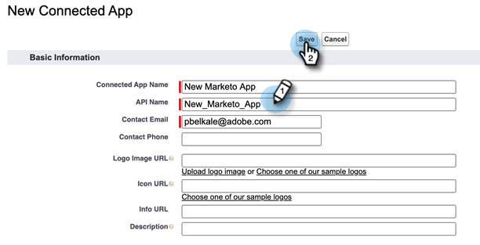
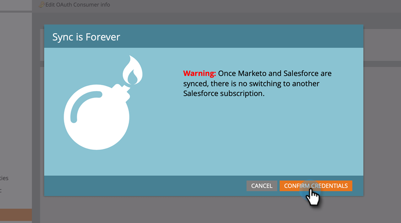

# Konfigurerar OAuth 2.0 {#setting-up-oauth-2-0}

Salesforce använder OAuth-protokollet för att tillåta användare av program att på ett säkert sätt få åtkomst till (autentisera programmet med OAuth 2.0) data via REST API-anrop utan att behöva visa inloggningsuppgifter. Nedan beskrivs de steg som ska utföras för att ansluta och synkronisera Marketo säkert med Salesforce.

## Konfigurera ansluten app {#set-up-connected-app}

1. Gå till Appar, App Manager och klicka på **Ny ansluten app** under Konfigurera i Salesforce.

   

1. Fyll i informationen och klicka på **Spara**.

   

1. Klicka i kryssrutan **Aktivera OAuth-inställningar**. Ange `https://app.marketo.com/salesforce/getSfdcOAuthTokensRedirect` för återanrops-URL. Markera alla tillgängliga OAuth-scope och klicka på **Lägg till**.

   

1. Klicka på **Spara**.

   

1. Klicka på **Fortsätt**.

   

1. Copy the Consumer Key and Consumer Secret.

   

>[!NOTE]
>
>Spara informationen om konsumentnyckel och hemlighet för senare användning i Marketo.

## Konfigurera Marketo {#set-up-marketo}

>[!PREREQUISITES]
>
>* API-åtkomst måste vara aktiverat för Salesforce Sync User (om du är Salesforce Professional Edition-användare är den åtkomsten inte tillgänglig som standard - kontakta din Salesforce Account Executive).
>* Marketo Sync-användare måste skapas i Salesforce.
>* För befintliga kunder är funktionen&quot;Aktivera OAuth för SFDC-synkronisering&quot; aktiverad i kundens prenumeration.
>* Popup-blockerare är inaktiverade.
>* Ansluten app skapas och vi har konsumentnyckeln och konsumenthemligheten tillgängliga för användning.

1. I avsnittet Marketo Admin klickar du på **CRM** och sedan på **Synkronisera med Salesforce**.

   

1. Lägg till information om konsumentnyckel och hemlighet som du tidigare spelat in och klicka på och **Spara**.

   

1. Klicka på knappen **Logga in med Salesforce** på synkroniseringssidan för Marketo Salesforce.

   

1. Ett popup-fönster med inloggningssidan för Salesforce visas. Ange dina Marketo Sync-användaruppgifter och logga in.

   

1. Ange verifieringskoden som du fick via e-post (skickas av Salesforce) och klicka på **Verifiera**.

   

1. När verifieringen är klar visas åtkomstsidan och begär åtkomst. Klicka på **Tillåt**.

   

1. Om några minuter visas ett popup-fönster i Marketo. Klicka på **Bekräfta inloggningsuppgifter**.

   

1. När fältsynkroniseringen är klar klickar du på **Starta Salesforce-synkronisering**.

   

1. Klicka på **Starta synkronisering**.

   

Din synkronisering mellan Marketo och Salesforce pågår nu.

