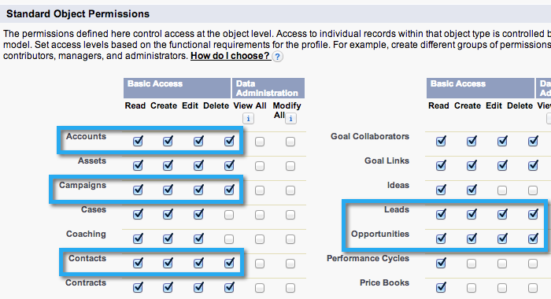
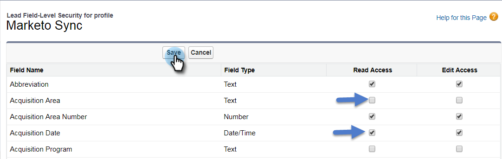

# Steg 2 av 3: Skapa en Salesforce-användare för Marketo (Enterprise/Unlimited) {#step-of-create-a-salesforce-user-for-marketo-enterprise-unlimited}

>[!NOTE]
>
>De här stegen måste utföras av en Salesforce-administratör

>[!PREREQUISITES]
>
>[Steg 1 av 3: Lägg till Marketo-fält i Salesforce (Enterprise/Unlimited)](/help/marketo/product-docs/crm-sync/salesforce-sync/setup/enterprise-unlimited-edition/step-1-of-3-add-marketo-fields-to-salesforce-enterprise-unlimited.md)

I den här artikeln ställer du in användarbehörigheter i Salesforce-profilen och skapar ett Marketo-Salesforce-integrationskonto.

## Skapa en profil {#create-a-profile}

1. Klicka på **Inställningar**.

   

1. Skriv &quot;profiler&quot; i navigeringsfältet och klicka på länken **Profiler**.

   

1. Klicka på **Nytt**.

   

1. Välj **Standardanvändare**, ge profilen namnet Marketo-Salesforce Sync och klicka på **Spara**.

   

## Ange profilbehörigheter {#set-profile-permissions}

1. Klicka på **Redigera** för att ange säkerhetsbehörigheter.

   

1. Kontrollera att följande rutor är markerade under **Administrativa behörigheter**:

   * API aktiverat
   * Redigera HTML-mallar
   * Hantera offentliga dokument
   * Hantera offentliga mallar

   

   >[!TIP]
   >
   >Markera rutan **Lösenordet upphör aldrig**.

1. Kontrollera att följande rutor är markerade under avsnittet Allmänna användarbehörigheter:

   * Konvertera leads
   * Redigera händelser
   * Redigera uppgifter

   

1. Under avsnittet Standardbehörigheter för objekt kontrollerar du att behörigheterna Läs, Skapa, Redigera och Ta bort är ikryssade:

   * Konton
   * Kampanjer
   * Kontakter
   * Leads
   * Möjligheter

   >[!NOTE]
   >
   >Bevilja behörigheter till kampanjerna om du tänker använda kampanjsynkronisering.

   

1. När du är klar klickar du på **Spara** längst ned på sidan.

   

## Ange fältbehörigheter {#set-field-permissions}

1. Diskutera med era marknadsförare för att ta reda på vilka anpassade fält som behövs för att synkronisera.

   >[!NOTE]
   >
   >Det här steget förhindrar att fält som du inte behöver visas i Marketo, vilket minskar störande detaljer och snabbar upp synkroniseringen.

1. Gå till avsnittet **Fältnivåsäkerhet** på profilinformationssidan. Klicka på **Visa** om du vill redigera tillgängligheten för objekten:

   * Lead
   * Kontakt
   * Konto
   * Möjligheter

   >[!TIP]
   >
   >Du kan konfigurera andra objekt efter organisationens behov.

   

1. Klicka på **Redigera** för varje objekt.

   

1. Leta reda på de fält som inte behövs, kontrollera att **Läs åtkomst** och **Redigera åtkomst** är avmarkerade. Klicka på **Spara** när du är klar.

   >[!NOTE]
   >
   >Redigera bara tillgängligheten för anpassade fält.

   

1. När du har inaktiverat alla onödiga fält måste du kontrollera **Läs åtkomst och Redigera åtkomst** för följande objektfält. Klicka på **Spara** när du är klar.

<table> 
 <tbody> 
  <tr> 
   <th colspan="1" rowspan="1">
Objekt
</th> 
   <th colspan="1" rowspan="1">
Fält
</th> 
  </tr> 
  <tr> 
   <td colspan="1" rowspan="1">
Konto
</td> 
   <td colspan="1" rowspan="1">
Typfält
</td> 
  </tr> 
  <tr> 
   <td colspan="1" rowspan="1">
Händelse
</td> 
   <td colspan="1" rowspan="1">
Alla fält
</td> 
  </tr> 
  <tr> 
   <td colspan="1" rowspan="1">
Uppgift
</td> 
   <td colspan="1" rowspan="1">
Alla fält
</td> 
  </tr> 
 </tbody> 
</table>

## Skapa Marketo-Salesforce-synkroniseringskonto {#create-marketo-salesforce-sync-account}

>[!TIP]
>
>Skapa ett dedikerat Salesforce-konto (t.ex. marketo@yourcompany.com) för att skilja de ändringar som gjorts av Marketo från andra Salesforce-användare.

1. Skriv&quot;Hantera användare&quot; i navigeringsfältet och klicka sedan på **Användare**. Klicka på **Ny användare**.

   

1. Fyll i de obligatoriska fälten. Välj sedan **användarlicens: Salesforce** och den profil som du skapade tidigare. Klicka på **Spara** när du är klar.

   

Steg 2 av 2 är slutförd.

>[!NOTE]
>
>[Steg 3 av 3: Connect Marketo och Salesforce (Enterprise/Unlimited)](/help/marketo/product-docs/crm-sync/salesforce-sync/setup/enterprise-unlimited-edition/step-3-of-3-connect-marketo-and-salesforce-enterprise-unlimited.md)
