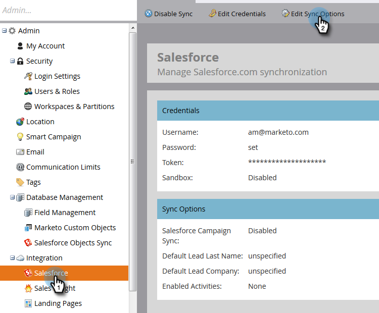

# Synkronisera aktiviteter {#customize-activities-sync}

Om du inte använder [Sales Insight](http://docs.marketo.com/display/DOCS/Marketo+Sales+Insight) kan Marketo skapa Salesforce-historikposter för aktivitet för vissa händelser. Så här aktiverar du dem.

1. Gå till **Admin. **

   

1. Klicka på **Salesforce** och sedan på **Redigera synkroniseringsalternativ**.

   

1. Markera rutorna bredvid aktiviteter som du vill att Marknad ska skicka till Salesforce och klicka sedan på **Spara**.

   

   >[!NOTE]
   >
   >När Marketo har aktiverats kommer han att puffa för tre månaders aktivitetshistorik. Beroende på mängden data kan *det ta flera dagar att slutföra*. Uppdateringar som inträffar under den initiala aktivitetspush-åtgärden kan fördröjas tills den initiala aktivitetssynkroniseringen har slutförts.

<table> 
 <colgroup> 
  <col> 
  <col> 
 </colgroup> 
 <thead> 
  <tr> 
   <th>Typ av aktivitet</th> 
   <th>Beskrivning</th> 
  </tr> 
 </thead> 
 <tbody> 
  <tr> 
   <td>Ifyllt formulär</td> 
   <td>Fyll i alla Marketo-formulär</td> 
  </tr> 
  <tr> 
   <td>Tillagd i listan</td> 
   <td>
Flödessteg: lades till i en statisk lista
</td> 
  </tr> 
  <tr> 
   <td>E-post skickad</td> 
   <td>Flödessteg: Har skickats ett e-postmeddelande</td> 
  </tr> 
  <tr> 
   <td>E-post levererad</td> 
   <td>Har tagit emot ett e-postmeddelande (inte studsat)</td> 
  </tr> 
  <tr> 
   <td>E-post öppnad</td> 
   <td>Öppnade ett e-postmeddelande (utan blockerade bilder)</td> 
  </tr> 
  <tr> 
   <td>Klicka på länken i e-postmeddelandet</td> 
   <td>Klicka på en länk i ett e-postmeddelande som skickats av Marketo</td> 
  </tr> 
  <tr> 
   <td>Borttagen från listan</td> 
   <td>Flödessteg: togs bort från en statisk lista</td> 
  </tr> 
  <tr> 
   <td>Ta bort från flöde</td> 
   <td>Flödessteg: Ta bort från flöde</td> 
  </tr> 
  <tr> 
   <td>E-postmeddelande har skickats</td> 
   <td>Har skickats ett e-postmeddelande via Marketo Sales Insight</td> 
  </tr> 
  <tr> 
   <td>E-postadress öppnad</td> 
   <td>Öppnade ett e-postmeddelande som skickats via Marketo Sales Insight</td> 
  </tr> 
  <tr> 
   <td>Klicka på länken i e-postmeddelandet om försäljning</td> 
   <td>Klicka på en länk i ett e-postmeddelande som skickats via Marketo Sales Insight</td> 
  </tr> 
  <tr> 
   <td>E-postmeddelande har tagits emot</td> 
   <td>Ett e-postmeddelande togs emot och loggades av säljaren i MSI Outlook-plugin-programmet</td> 
  </tr> 
 </tbody> 
</table>

>[!NOTE]
>
>**Påminnelse**
>
>
>&quot;E-post som tagits emot&quot; innebär **inte** levererat. Leveransstatus hämtas inte för e-postmeddelanden som skickas via Sales Insight.

>[!TIP]
>
>Om du är intresserad av att få in mer marknadsföringsinformation i Salesforce kan du ta en titt på vår [Marketo Sales Insight](../../../../../product-docs/marketo-sales-insight/msi-for-salesforce/installation/install-marketo-sales-insight-package-in-salesforce-appexchange.md)-produkt.

