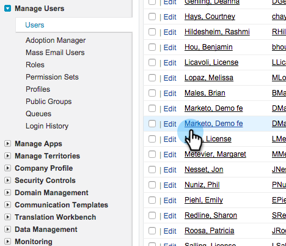
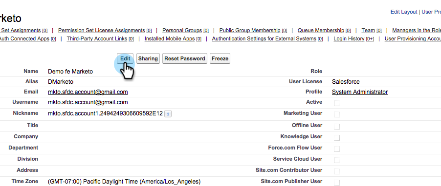

# Gör Marketo Sync User till marknadsföringsanvändare {#make-marketo-sync-user-a-marketing-user}

[Marketo-synkroniseringsanvändaren](/help/marketo/product-docs/crm-sync/salesforce-sync/setup/enterprise-unlimited-edition/step-2-of-3-create-a-salesforce-user-for-marketo-enterprise-unlimited.md){target="_blank"} måste vara en Marketing-användare för att Salesforce kampanjsynkronisering ska fungera korrekt. Så här gör du för att göra användaren till marknadsföringsanvändare i Salesforce.

>[!NOTE]
>
>**Administratörsbehörigheter krävs**

1. Logga in på Salesforce. Sök efter användare i det vänstra sökfältet och klicka på **[!UICONTROL Users]** under **[!UICONTROL Managing Users]**.

   

1. Hitta synkroniseringsanvändaren och klicka på deras namn.

   

1. Klicka på **[!UICONTROL Edit]**.

   

1. Markera kryssrutan **[!UICONTROL Marketing User]** och klicka på **[!UICONTROL Save]**.

   

   Bra! Den här synkroniserade Marketo-användaren är nu en marknadsföringsanvändare.
