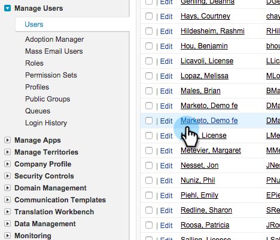

# Gör Marketo Sync User till marknadsföringsanvändare {#make-marketo-sync-user-a-marketing-user}

[Marketo synkroniseringsanvändare](/help/marketo/product-docs/crm-sync/salesforce-sync/setup/enterprise-unlimited-edition/step-2-of-3-create-a-salesforce-user-for-marketo-enterprise-unlimited.md) måste vara en marknadsföringsanvändare för Salesforce-kampanjsynkroniseringen för att fungera korrekt. Så här gör du för att göra användaren till en marknadsföringsanvändare i Salesforce.

>[!NOTE]
>
>**Administratörsbehörigheter krävs**

1. Logga in i Salesforce. Sök efter användare i det vänstra sökfältet och klicka på **Användare** under **Hantera användare**.

   

1. Hitta synkroniseringsanvändaren och klicka på deras namn.

   

1. Klicka på **Redigera**.

   

1. Markera kryssrutan **Marknadsförare** och klicka på **Spara**.

   

   Bra! Den här synkroniserade Marketo-användaren är nu en marknadsföringsanvändare.
