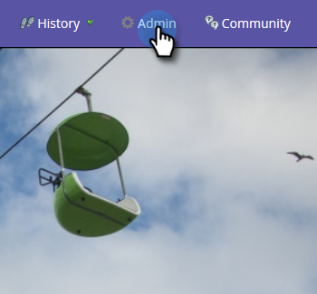

# Aktivera/inaktivera synkronisering av anpassat objekt {#enable-disable-custom-object-sync}

Anpassade objekt som skapas i Salesforce-instansen kan också ingå i Marketo. Så här ställer du in det.

## Aktivera/inaktivera synkronisering av anpassat objekt {#enable-disable-custom-object-sync-1}

>[!NOTE]
>
>Administratörsrättigheter krävs.

1. Klicka på **Admin**.

   ** 

   **

1. Klicka på **Salesforce** **Objektsynkronisering** på menyn Databashantering.

   

1. Om det här är ditt första anpassade objekt klickar du på **Synkronisera schema.** Annars klickar du på  **Uppdatera** schema för att kontrollera att du har det senaste.

   

1. Om den globala synkroniseringen körs måste du inaktivera den genom att klicka på **Inaktivera global synkronisering.**

   

   >[!NOTE]
   >
   >Det kan ta några minuter att synkronisera det anpassade Salesforce-objektschemat.

1. Klicka på **Uppdatera schema**.

   

1. Markera det objekt som du vill synkronisera och klicka på **Aktivera synkronisering**.

   >[!TIP]
   >
   >Marketo kan bara synkronisera ett anpassat objekt om det har en direkt relation till lead-, kontakt- eller kontoobjektet i Salesforce.

   

1. Klicka på **Aktivera synkronisering** igen.

   ** 

   **

1. Gå tillbaka till fliken **Salesforce** och klicka på **Aktivera synkronisering**.

   

## Använda dina anpassade objekt {#using-your-custom-objects}

>[!NOTE]
>
>Du kan inte använda anpassade objekt i smarta kampanjer med utlösare.

1. Dra över filtret **Har möjlighet** i den smarta listan och ställ in på&#x200B;**true**.

   

1. Använd sedan filterbegränsningar för att begränsa fokus.

   

   Underbar! Nu kan du använda det här anpassade objektets data i smarta kampanjer och smarta listor.

>[!MORELIKETHIS]
>
>* [Lägg till/ta bort anpassat objektfält som smart lista/utlösarbegränsningar](add-remove-custom-object-field-as-smart-list-trigger-constraints.md)

>

