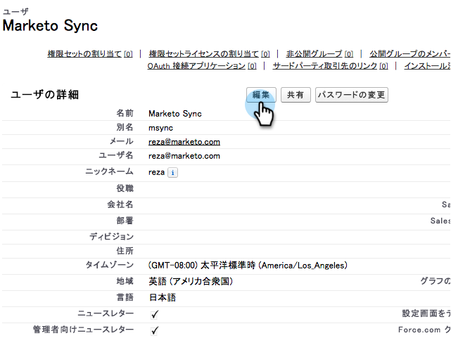

# Aktivera icke-engelsk anpassad objektsynkronisering {#enable-non-english-custom-object-sync}

Om Marketo-synkroniseringsanvändaren är inställd på ett annat språk än engelska kan du råka ut för ett fel när du försöker aktivera en anpassad objektsynkronisering.

## Felet {#the-error}

## Komma runt det {#getting-around-it}

1. Logga in i Salesforce med markeringen för att synkronisera användaren.

   

1. Gå till **Inställningar** under användarnamnet.

   

1. Under **Personlig information** klickar du på **Min personliga information**.

   

1. Klicka på **Redigera**.

   

1. Ändra **Språk** till **Engelska**.

   

1. Klicka på **Spara**.

   

1. Tillbaka till Marketo, under **Admin > Salesforce > Objekt** klickar du på **Uppdatera schema**.

   

1. Objektivlistan kommer då att visas på engelska. Markera det objekt du vill använda och klicka på **Aktivera synkronisering**.

   

1. Observera att ditt anpassade objekt nu är aktiverat och synkroniseras.

   

1. Gå nu tillbaka till Salesforce och använd stegen ovan för att ändra synkroniseringsanvändaren tillbaka till det språk du föredrar.

>[!NOTE]
>
>**Påminnelse**
>
>Glöm inte att uppdatera schemat en sista gång för att hämta tillbaka objekten på ditt språk.

