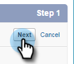

# Steg 1 av 3: Lägg till Marketo-fält i [!DNL Salesforce] (Professional) {#step-of-add-marketo-fields-to-salesforce-professional}

>[!PREREQUISITES]
>
>Din Salesforce-instans måste ha tillgång till Salesforce API:er för att kunna synkronisera data mellan Marketo Engage och Salesforce.

Marketo använder en uppsättning fält för att samla in viss typ av marknadsföringsrelaterad information. Om du vill ha dessa data i [!DNL Salesforce] följer du instruktionerna nedan.

1. Skapa tre anpassade fält i [!DNL Salesforce] för lead- och kontaktobjekten: poäng, anskaffningsprogram och anskaffningsdatum.
1. Mappa dessa anpassade fält mellan leads och kontakter så att värdena överförs vid konvertering i [!DNL Salesforce].
1. Du kan skapa ytterligare fält om det behövs (se tabellen nedan).

Alla dessa anpassade fält är valfria och krävs inte för att synkronisera Marketo och [!DNL Salesforce]. Vi rekommenderar att du skapar fält för poäng, anskaffningsprogram och anskaffningsdatum.

## Lägg till Marketo-fält i [!DNL Salesforce] {#add-marketo-fields-to-salesforce}

Lägg till tre anpassade fält i lead- och kontaktobjekten i [!DNL Salesforce] som anges ovan. Om du vill lägga till fler fält kan du läsa tabellen med tillgängliga fält i slutet av det här avsnittet.

Utför följande steg för vart och ett av de tre anpassade fälten för att lägga till dem. Börja med **[!UICONTROL Score]**.

1. Logga in på Salesforce och klicka på **[!UICONTROL Setup]**.

   

1. Klicka på **[!UICONTROL Customize]** på menyn Skapa till vänster och välj **[!UICONTROL Leads]**. Klicka på **[!UICONTROL Fields]**.

   

1. Klicka på **[!UICONTROL New]** i avsnittet Anpassade fält och relationer längst ned på sidan.

   

1. Välj lämplig fälttyp (för poäng - **[!UICONTROL number]**; förvärvsprogram - **[!UICONTROL text]**; förvärvad - **Datum/tid**).

   

1. Klicka på **[!UICONTROL Next]**.

   

1. Ange [!UICONTROL Field Label], [!UICONTROL Length] och [!UICONTROL Field Name] för fältet, vilket visas i tabellen nedan.

<table>
 <thead>
  <tr>
   <th>
    

      Fältetikett
    
</th>
   <th>
    

      Fältnamn
    
</th>
   <th>
    

      Datatyp
    
</th>
   <th>
    

      Fältattribut
    
</th>
  </tr>
 </thead>
 <tbody>
  <tr>
   <td>Poäng</td>
   <td>mkto71_Lead_Score</td>
   <td>Nummer</td>
   <td>Längd 10 Decimaler 0 </td>
  </tr>
  <tr>
   <td>Anskaffningsdatum</td>
   <td>mkto71_Acquisition_Date</td>
   <td>Datum/tid</td>
   <td> </td>
  </tr>
  <tr>
   <td>Anskaffningsprogram</td>
   <td>mkto71_Acquisition_Program</td>
   <td>Text</td>
   <td>Längd 255</td>
  </tr>
 </tbody>
</table>

>[!NOTE]
>
>[!DNL Salesforce] lägger till __c i fältnamn när de används för att skapa API-namn.

>[!NOTE]
>
>Text- och nummerfält kräver en längd, men inte datum-/tidsfält. En beskrivning är valfri.

1. Klicka på **[!UICONTROL Next]**.

   

1. Ange åtkomstinställningarna och klicka på **[!UICONTROL Next]**:

   * Ange alla roller till **[!UICONTROL Visible]** och **[!UICONTROL Read-Only]**

   * Avmarkera kryssrutan **[!UICONTROL Read-Only]** för din synkroniseringsanvändares profil:

      * Om du har en användare med profilen för en _systemadministratör_ som synkroniseringsanvändare, avmarkerar du kryssrutan **[!UICONTROL Read-Only]** för systemadministratörsprofilen (se nedan)

      * Om du har skapat en _anpassad profil_ för synkroniseringsanvändaren avmarkerar du kryssrutan **[!UICONTROL Read-Only]** för den anpassade profilen

   

1. Välj de sidlayouter som ska visa fältet.

   

1. Klicka på **[!UICONTROL Save & New]** om du vill gå tillbaka och skapa de två andra anpassade fälten. Klicka på **[!UICONTROL Save]** när du är klar med alla tre.

   

1. Klicka på **[!UICONTROL Customize]** på menyn Skapa till vänster och välj **[!UICONTROL Contacts]**. Klicka på **[!UICONTROL Fields]**.
1. Utför steg 3 till 10 för fälten Poäng, Inköpsdatum och Anskaffningsprogram på kontaktobjektet, precis som för lead-objektet.
1. Du kan också använda ovanstående procedur för ytterligare anpassade fält från den här tabellen.

<table>
 <tbody>
  <tr>
   <th>Fältetikett</th>
   <th>Fältnamn</th>
   <th>Datatyp</th>
   <th>Fältattribut</th>
  </tr>
  <tr>
   <td>ID för förvärvsprogram</td>
   <td>mkto71_Acquisition_Program_Id</td>
   <td>Nummer</td>
   <td>Längd 18 Decimaler 0 </td>
  </tr>
  <tr>
   <td>Ursprunglig referens</td>
   <td>mkto71_Original_Referrer</td>
   <td>Text</td>
   <td>Längd 255</td>
  </tr>
  <tr>
   <td>Ursprunglig sökmotor</td>
   <td>mkto71_Original_Search_Engine</td>
   <td>Text</td>
   <td>Längd 255</td>
  </tr>
  <tr>
   <td>Ursprunglig sökfras</td>
   <td>mkto71_Original_Search_Phrase</td>
   <td>Text</td>
   <td>Längd 255</td>
  </tr>
  <tr>
   <td>Ursprunglig Source-information</td>
   <td>mkto71_Original_Source_Info</td>
   <td>Text</td>
   <td>Längd 255</td>
  </tr>
  <tr>
   <td>Ursprunglig Source-typ</td>
   <td>mkto71_Original_Source_Type</td>
   <td>Text</td>
   <td>Längd 255</td>
  </tr>
  <tr>
   <td>Inaktuell ort</td>
   <td>mkto71_Insted_City</td>
   <td>Text</td>
   <td>Längd 255</td>
  </tr>
  <tr>
   <td>Berört företag</td>
   <td>mkto71_Insted_Company</td>
   <td>Text</td>
   <td>Längd 255</td>
  </tr>
  <tr>
   <td>Berört land</td>
   <td>mkto71_Insted_Country</td>
   <td>Text</td>
   <td>Längd 255</td>
  </tr>
  <tr>
   <td>Ingående metropolitområde</td>
   <td>mkto71_Insted_Metropolitan_Area</td>
   <td>Text</td>
   <td>Längd 255</td>
  </tr>
  <tr>
   <td>Riktnummer för inkommande telefon</td>
   <td>mkto71_Insted_Phone_Area_Code</td>
   <td>Text</td>
   <td>Längd 255</td>
  </tr>
  <tr>
   <td>Infört postnummer</td>
   <td>mkto71_Insted_Postal_Code</td>
   <td>Text</td>
   <td>Längd 255</td>
  </tr>
  <tr>
   <td>Ingångsregion</td>
   <td>mkto71_Insted_State_Region</td>
   <td>Text</td>
   <td>Längd 255</td>
  </tr>
 </tbody>
</table>

>[!NOTE]
>
>Värden i fält som automatiskt tilldelats av Marketo är inte omedelbart tillgängliga i [!DNL Salesforce] när det nya fältet har skapats. Marketo synkroniserar data till [!DNL Salesforce] vid nästa uppdatering till posten på båda systemen (d.v.s. en uppdatering till något av de synkroniserade fälten mellan Marketo och [!DNL Salesforce]).

## Mappa anpassade fält för konverteringar  {#map-custom-fields-for-conversions}

Ett anpassat fält på lead-objektet i [!DNL Salesforce] ska mappas till ett kontaktfält på kontaktobjektet så att data överförs när en konvertering inträffar.

1. Klicka på **[!UICONTROL Setup]** i det övre högra hörnet.

   

1. Skriv [!UICONTROL fields] i navigeringssökningen utan att trycka på Retur. Fält visas under olika objekt. Klicka **[!UICONTROL Fields]** under Leads.

   

1. Gå till avsnittet Leadanpassade fält och relationer och klicka på **[!UICONTROL Map Lead Fields]**.

   

1. Klicka på listrutan bredvid fältet som du vill mappa.

   

1. Välj motsvarande anpassat kontaktfält.

   

1. Upprepa stegen ovan för alla andra fält som du har skapat.
1. Klicka på **[!UICONTROL Save]** när du är klar.

Inte så lätt, eller hur?

>[!MORELIKETHIS]
>
>[Steg 2 av 3: Skapa en Salesforce-användare för Marketo (Professional)](/help/marketo/product-docs/crm-sync/salesforce-sync/setup/professional-edition/step-2-of-3-create-a-salesforce-user-for-marketo-professional.md){target="_blank"}
