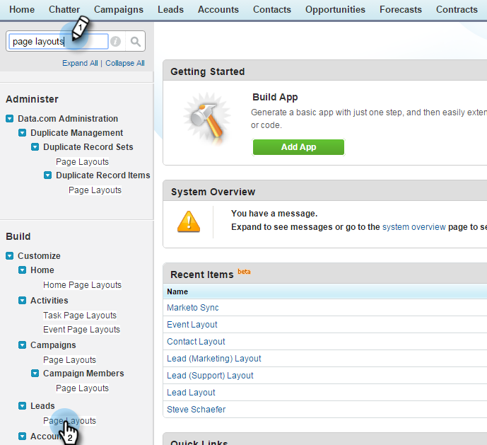

# Steg 2 av 3: Skapa en Salesforce-användare för Marketo (Professional) {#step-of-create-a-salesforce-user-for-marketo-professional}

>[!NOTE]
>
>De här stegen måste utföras av en Salesforce-administratör

>[!PREREQUISITES]
>
>* [Steg 1 av 3: Lägg till Marketo-fält i Salesforce (Professional)](step-1-of-3-add-marketo-fields-to-salesforce-professional.md)

>

I den här artikeln ska du anpassa fältbehörigheter med en Salesforce-sidlayout och skapa en Marketo-Salesforce-synkroniseringsanvändare.

## Ange sidlayout {#set-page-layouts}

Salesforce Professional anger tillgänglighet på fältnivå med sidlayouter, i motsats till Salesforce Enterprise/Unlimited&#39;s Profiles. Med de här stegen kan Marketto synkronisera användaren för att uppdatera anpassade fält.

1. Skriv **sidlayouter** i navigeringsfältet utan att trycka på **Enter** och klicka på **Sidlayout** under **Leads**.

   

1. Klicka på **Redigera** bredvid Leadlayout.

   

1. Klicka och dra ett nytt **avsnitt** till sidlayouten.

   

1. Ange Marketo för **Avsnittsnamn** och klicka på **OK**.

   

1. Klicka och dra fältet **Anskaffningsdatum** till avsnittet **Marketo**.

   

1. Upprepa ovanstående steg för följande fält:

   * Anskaffningsprogram
   * ID för förvärvsprogram
   * Avanmäl dig via e-post
   * Inaktuell ort
   * Infört företag
   * Infört land
   * Ingående metropolitområde
   * Riktnummer för inkommande telefon
   * Infört postnummer
   * Ingångsregion
   * Leadpoäng
   * Ursprunglig referens
   * Ursprunglig sökmotor
   * Ursprunglig sökfras
   * Ursprunglig källinformation
   * Ursprunglig källtyp

   >[!NOTE]
   >
   >Dessa fält måste finnas i sidlayouten så att Marketo kan läsa/skriva till dem.

   >[!TIP]
   >
   >Skapa två kolumner för fälten genom att dra nedåt till höger på sidan. Du kan flytta fält från den ena sidan till den andra om du vill balansera kolumnlängden.

1. Klicka på **Spara** när du är klar med att lägga till fält.

   

1. Upprepa alla ovanstående steg för Salesforce **Kontaktsidlayout**.

   

1. Kom ihåg att klicka på **Spara** när du är klar med **Kontaktsidans layout**.

   

   >[!NOTE]
   >
   >**Påminnelse**
   >
   >
   >Kontrollera att fältet **Heldagshändelse** har lagts till i **händelsesidlayouten**.

## Skapa synkroniseringsanvändare {#create-sync-user}

Marketo kräver inloggningsuppgifter för att få åtkomst till Salesforce. Detta görs bäst med en dedikerad användare som skapats med stegen nedan.

>[!NOTE]
>
>Om din organisation inte har några ytterligare Salesforce-licenser kan du använda en befintlig **marknadsföringsanvändare** med profilen **Systemadministratör**.

1. Ange &quot;användare&quot; i navigeringsfältet och klicka på **Användare** under **Hantera användare**.

   

1. Klicka på **Ny användare**.

   

1. Fyll i de obligatoriska fälten och välj **Användarlicens: Salesforce**, ange **profilen: Systemadministratör**, kontrollera **Marknadsförare** och klicka på **Spara**.

   

   >[!TIP]
   >
   >Kontrollera att den e-postadress du anger är giltig. Du måste logga in som synkroniseringsanvändare för att återställa lösenordet.

Underbar! Nu har du ett konto som Marketo kan använda för att ansluta till Salesforce. Låt oss göra det.

>[!NOTE]
>
>**Relaterade artiklar**
>
>* [Steg 3 av 3: Connect Marketo och Salesforce (Professional)](step-3-of-3-connect-marketo-and-salesforce-professional.md)

>

