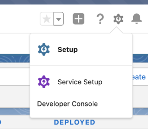

# Steg 1 av 3: Lägg till Marketo-fält i Veeva CRM {#step-1-of-3-add-marketo-fields-to-veeva-crm}

>[!PREREQUISITES]
>
>Veeva CRM-instansen måste ha tillgång till Salesforce API:er för att kunna synkronisera data mellan Marketo Engage och Veeva CRM.

Marketo Engage använder en uppsättning fält för att hämta in viss typ av marknadsföringsrelaterad information. Om du vill ha dessa data i Veeva CRM följer du instruktionerna nedan.

`1.` Skapa ett anpassat fält i Veeva CRM för kontaktobjekten: Poäng

`2.` Du kan skapa ytterligare fält om du vill (se tabellen nedan).

Alla dessa anpassade fält är valfria och behövs inte för att synkronisera Marketo Engage och Veeva CRM.

## Lägg till Marketo-fält i Veeva CRM {#add-marketo-fields-to-veeva-crm}

Lägg till ett anpassat fält på lead- och kontaktobjekten i Veeva CRM som listas ovan. Om du vill lägga till fler fält kan du läsa tabellen med tillgängliga fält i slutet av det här avsnittet.

Utför följande steg för fältet Poäng för att lägga till det.

1. Logga in på Veeva CRM och klicka på **Inställningar**.

   

1. Klicka på Objekt och fält och välj Objektshanteraren.

   

1. Sök efter Kontakt i sökfältet.

   

1. Klicka på kontaktobjektet.

1. Välj Fält och relationer.

1. Klicka **Nytt**.

   

1. Välj lämplig fälttyp (för Poäng - tal).

   

1. Klicka **Nästa**.

   

1. Ange fältetikett, längd och fältnamn enligt tabellen nedan.

<table>
 <tbody>
  <tr>
   <th>Fältetikett
   <th>Fältnamn
   <th>Datatyp
   <th>Fältattribut
  </tr>
  <tr>
   <td>Poäng</td>
   <td>mkto71_Lead_Score</td>
   <td>Antal</td>
   <td>Längd 10 
Decimaler 0</td>
  </tr>
 </tbody>
</table>

>[!NOTE]
>
>Veeva CRM lägger till __c i fältnamn när de används för att skapa API-namn.

>[!NOTE]
>
>Text- och nummerfält måste ha en längd, men inte datum-/tidfält. En beskrivning är valfri.

1. Klicka **Nästa**.

   

1. Ange åtkomstinställningar och klicka på **Nästa**.

1. Ställ in alla roller till Synlig och Skrivskyddad.

1. Avmarkera kryssrutan Skrivskyddad för din synkroniseringsanvändares profil:

* Om du har en användare med profilen för en systemadministratör som synkroniseringsanvändare avmarkerar du kryssrutan Skrivskyddad för systemadministratörsprofilen (se nedan).
* Om du har skapat en anpassad profil för synkroniseringsanvändaren avmarkerar du kryssrutan Skrivskyddad för den anpassade profilen.

  

1. Välj de sidlayouter som ska visa fältet.

1. Klicka **Spara och ny** för att gå tillbaka och skapa de två andra anpassade fälten.

1. Klicka **Spara** när du är klar med alla tre.

   

>[!NOTE]
>
>Genom att lägga till fältet i kontaktobjektet läggs de även till i personkontoobjektet.

VALFRITT: Använd ovanstående procedur för ytterligare anpassade fält från tabellen nedan.

<table>
 <tbody>
  <tr>
   <th>Fältetikett
   <th>Fältnamn
   <th>Datatyp
   <th>Fältattribut
  </tr>
  <tr>
   <td>Inaktuell ort</td>
   <td>mkto71_Insted_City</td>
   <td>Text</td>
   <td>Längd 255</td>
  </tr>
  <tr>
   <td>Berört företag</td>
   <td>mkto71_Insted_Company</td>
   <td>Text</td>
   <td>Längd 255</td>
  </tr>
  <tr>
   <td>Berört land</td>
   <td>mkto71_Insted_Country</td>
   <td>Text</td>
   <td>Längd 255</td>
  </tr>
  <tr>
   <td>Ingående metropolitområde</td>
   <td>mkto71_Insted_Metropolitan_Area</td>
   <td>Text</td>
   <td>Längd 255</td>
  </tr>
  <tr>
   <td>Riktnummer för inkommande telefon</td>
   <td>mkto71_Insted_Phone_Area_Code</td>
   <td>Text</td>
   <td>Längd 255</td>
  </tr>
  <tr>
   <td>Infört postnummer</td>
   <td>mkto71_Insted_Postal_Code</td>
   <td>Text</td>
   <td>Längd 255</td>
  </tr>
  <tr>
   <td>Ingångsregion</td>
   <td>mkto71_Insted_State_Region</td>
   <td>Text</td>
   <td>Längd 255</td>
  </tr>
 </tbody>
</table>

>[!NOTE]
>
>Värden i fält som automatiskt tilldelats av Marketo är inte omedelbart tillgängliga i Veeva CRM när det nya fältet har skapats. Marketo synkroniserar data till Veeva CRM vid nästa uppdatering av posten i något av systemen (dvs. en uppdatering av något av de synkroniserade fälten mellan Marketo och Veeva CRM).
