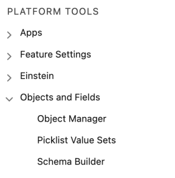
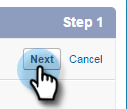
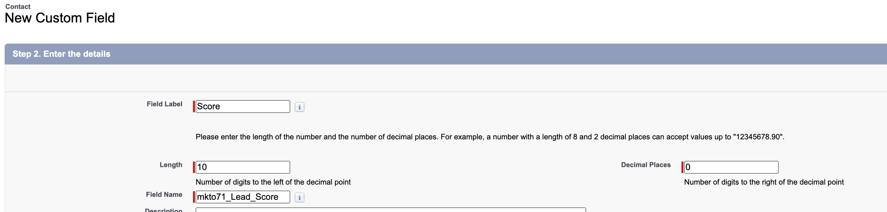
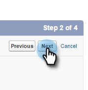
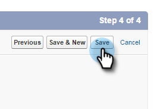

# Steg 1 av 3: Lägg till Marketo-fält i [!DNL Veeva] CRM {#step-1-of-3-add-marketo-fields-to-veeva-crm}

>[!PREREQUISITES]
>
>CRM-instansen [!DNL Veeva] måste ha åtkomst till Salesforce API:er för att kunna synkronisera data mellan Marketo Engage och [!DNL Veeva] CRM.

Marketo Engage använder en uppsättning fält för att samla in viss typ av marknadsföringsrelaterad information. Om du vill ha dessa data i [!DNL Veeva] CRM följer du instruktionerna nedan.

1. Skapa ett anpassat fält i [!DNL Veeva] CRM för kontaktobjekten: Poäng
1. Du kan skapa ytterligare fält om du vill (se tabellen nedan).

Alla dessa anpassade fält är valfria och behöver inte synkronisera Marketo Engage och [!DNL Veeva] CRM.

## Lägg till Marketo-fält i [!DNL Veeva] CRM {#add-marketo-fields-to-veeva-crm}

Lägg till ett anpassat fält på lead- och kontaktobjekten i [!DNL Veeva] CRM som listas ovan. Om du vill lägga till fler fält kan du läsa tabellen med tillgängliga fält i slutet av det här avsnittet.

Utför följande steg för fältet Poäng för att lägga till det.

1. Logga in på [!DNL Veeva] CRM och klicka på **[!UICONTROL Setup]**.

   

1. Klicka på **[!UICONTROL Objects and Fields]** och välj **[!UICONTROL Object Manager]**.

   

1. Sök efter &quot;Kontakt&quot; i sökfältet.

   

1. Klicka på objektet **[!UICONTROL Contact]**.

1. Välj **[!UICONTROL Fields and Relationships]**.

1. Klicka på **[!UICONTROL New]**.

   

1. Välj lämplig fälttyp (för Poäng - tal).

   

1. Klicka på **[!UICONTROL Next]**.

   

1. Ange **[!UICONTROL Field Label]**, **[!UICONTROL Length]** och **[!UICONTROL Field Name]** för fältet, vilket visas i tabellen nedan.

<table>
 <tbody>
  <tr>
   <th>Fältetikett
   <th>Fältnamn
   <th>Datatyp
   <th>Fältattribut
  </tr>
  <tr>
   <td>Poäng</td>
   <td>mkto71_Lead_Score</td>
   <td>Nummer</td>
   <td>Längd 10 
Decimaler 0</td>
  </tr>
 </tbody>
</table>

>[!NOTE]
>
>[!DNL Veeva] CRM lägger till __c i fältnamn när de används för att skapa API-namn.

>[!NOTE]
>
>Text- och nummerfält kräver en längd, men inte datum-/tidsfält. En beskrivning är valfri.

1. Klicka på **[!UICONTROL Next]**.

   

1. Ange åtkomstinställningarna och klicka på **[!UICONTROL Next]**.

1. Ange alla roller till **[!UICONTROL Visible]** och **[!UICONTROL Read-Only]**.

1. Avmarkera kryssrutan **[!UICONTROL Read-Only]** för din synkroniseringsanvändares profil:

* Om du har en användare med en systemadministratörsprofil som synkroniseringsanvändare avmarkerar du kryssrutan [!UICONTROL Read-Only] för systemadministratörsprofilen (se nedan).
* Om du har skapat en anpassad profil för synkroniseringsanvändaren avmarkerar du kryssrutan [!UICONTROL Read-Only] för den anpassade profilen.

  

1. Välj de sidlayouter som ska visa fältet.

1. Klicka på **[!UICONTROL Save & New]** om du vill gå tillbaka och skapa de två andra anpassade fälten.

1. Klicka på **[!UICONTROL Save]** när du är klar med alla tre.

   

>[!NOTE]
>
>Genom att lägga till fältet i kontaktobjektet läggs de även till i personkontoobjektet.

VALFRITT: Använd ovanstående procedur för ytterligare anpassade fält från tabellen nedan.

<table>
 <tbody>
  <tr>
   <th>Fältetikett
   <th>Fältnamn
   <th>Datatyp
   <th>Fältattribut
  </tr>
  <tr>
   <td>Inaktuell ort</td>
   <td>mkto71_Insted_City</td>
   <td>Text</td>
   <td>Längd 255</td>
  </tr>
  <tr>
   <td>Berört företag</td>
   <td>mkto71_Insted_Company</td>
   <td>Text</td>
   <td>Längd 255</td>
  </tr>
  <tr>
   <td>Berört land</td>
   <td>mkto71_Insted_Country</td>
   <td>Text</td>
   <td>Längd 255</td>
  </tr>
  <tr>
   <td>Ingående metropolitområde</td>
   <td>mkto71_Insted_Metropolitan_Area</td>
   <td>Text</td>
   <td>Längd 255</td>
  </tr>
  <tr>
   <td>Riktnummer för inkommande telefon</td>
   <td>mkto71_Insted_Phone_Area_Code</td>
   <td>Text</td>
   <td>Längd 255</td>
  </tr>
  <tr>
   <td>Infört postnummer</td>
   <td>mkto71_Insted_Postal_Code</td>
   <td>Text</td>
   <td>Längd 255</td>
  </tr>
  <tr>
   <td>Ingångsregion</td>
   <td>mkto71_Insted_State_Region</td>
   <td>Text</td>
   <td>Längd 255</td>
  </tr>
 </tbody>
</table>

>[!NOTE]
>
>Värden i fält som automatiskt tilldelats av Marketo är inte omedelbart tillgängliga i [!DNL Veeva] CRM när det nya fältet har skapats. Marketo synkroniserar data till [!DNL Veeva] CRM vid nästa uppdatering till posten i något av systemen (d.v.s. en synkroniserad uppdatering av något av fälten mellan Marketo och [!DNL Veeva] CRM).
