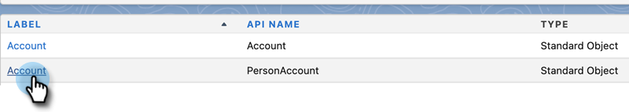
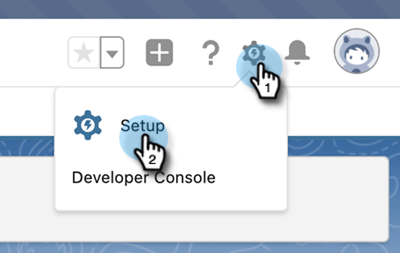

# Steg 2 av 3: Skapa en Veeva CRM-användare för Marketo Engage {#step-2-of-3-create-a-veeva-crm-user-for-marketo-engage}

>[!NOTE]
>
>Stegen i den här artikeln måste slutföras av en Veeva CRM-administratör.

>[!PREREQUISITES]
>
>[Steg 1 av 3: Lägg till Marketo-fält i Salesforce (Professional)](/help/marketo/product-docs/crm-sync/veeva-crm-sync/setup/step-1-of-3-add-marketo-fields-to-veeva-crm.md){target="_blank"}

I den här artikeln ska du anpassa fältbehörigheter med en veeva CRM-sidlayout och skapa en Marketo-veeva CRM-synkroniseringsanvändare.

## Ange sidlayout {#set-page-layouts}

Om du följer de här stegen kan Marketo synkroniseringsanvändare uppdatera anpassade fält.

1. Klicka på sidlayouten Konto (personkonto) i navigeringsfältet utan att trycka på Retur och klicka sedan på Sidlayout under Kontakter.

   

1. Klicka **Sidlayouter**.

   

1. Klicka **HCP - Professional**.

   

1. Klicka och dra en ny **Avsnitt** till sidlayouten.

1. Ange&quot;Marketo&quot; som avsnittsnamn och klicka på **OK**.

   

1. Klicka och dra bakgrundsmusiken till Marketo-delen.

   

1. Upprepa ovanstående steg för följande fält:

   * Inaktuell ort
   * Berört företag
   * Berört land
   * Ingående metropolitområde
   * Riktnummer för inkommande telefon
   * Infört postnummer
   * Ingångsregion

   >[!NOTE]
   >
   >Dessa fält måste finnas i sidlayouten så att Marketo kan läsa/skriva till dem.

   >[!TIP]
   >
   >Skapa två kolumner för fälten genom att dra nedåt till höger på sidan. Du kan flytta fält från den ena sidan till den andra om du vill balansera kolumnlängden.

1. När du är klar med HCP-Professional-layouten klickar du på **Spara**.

   

>[!NOTE]
>
>Upprepa detta för andra sidlayouter för konton.

## Skapa en profil {#create-a-profile}

1. Klicka **Inställningar**.

   

1. Skriv&quot;profiler&quot; i navigeringsfältet och klicka på **Profiler** länk.

   

1. Klicka **Nytt**.

   

1. Välj standardanvändare, ge profilen namnet&quot;Marketo-Salesforce-synkronisering&quot; och klicka på **Spara**.

   

## Ange profilbehörigheter {#set-profile-permissions}

1. Klicka **Redigera** för att ange säkerhetsbehörigheter.

   

1. Kontrollera att API-aktivering är markerat under Administrativa behörigheter.

   

   >[!TIP]
   >
   >Markera rutan Lösenordet upphör aldrig att gälla.

1. Se till att Redigera händelser och Redigera uppgifter är markerade under avsnittet Allmänna användarbehörigheter.

   

1. Under avsnittet Standardobjektbehörigheter kontrollerar du att behörigheterna Läs, Skapa, Redigera och Ta bort är markerade för Konton och Kontakter.

   

1. Under avsnittet Anpassade objektbehörigheter kontrollerar du att Läs-behörigheterna är markerade för Anrop, Anropa nyckelmeddelande och andra önskade anpassade objekt.

   

1. När du är klar klickar du på **Spara** längst ned på sidan.

   

## Ange fältbehörigheter {#set-field-permissions}

1. Diskutera med era marknadsförare för att ta reda på vilka anpassade fält som behövs för att synkronisera.

>[!NOTE]
>
>Det här steget förhindrar att fält som du inte behöver visas i Marketo, vilket gör att det blir enklare och snabbare att synkronisera.

1. Gå till avsnittet Fältnivåsäkerhet på profilinformationssidan. Klicka på Visa för att redigera tillgängligheten för objekten Kontakt och Konto.

   

>[!TIP]
>
>Du kan konfigurera andra objekt efter organisationens behov.

1. För varje objekt klickar du på **Redigera**.

   

Leta reda på de onödiga fälten och se till att Läs- och Redigera-åtkomst är **un** markerad. Klicka **Spara** när det är klart.

>[!NOTE]
>
>Redigera bara tillgängligheten för anpassade fält.

1. När du är klar med inaktiveringen av alla onödiga fält kontrollerar du Läs åtkomst och Redigera åtkomst för följande objektfält. Klicka på Spara när du är klar.

<table>
 <tbody>
  <tr>
   <th>Objekt
   <th>Fält
  </tr>
  <tr>
   <td>Konto</td>
   <td>Typfält</td>
  </tr>
  <tr>
   <td>Händelse</td>
   <td>Alla fält</td>
  </tr>
  <tr>
   <td>Uppgift</td>
   <td>Alla fält</td>
  </tr>
 </tbody>
</table>

## Skapa synkroniserad användare {#create-sync-user}

Marketo kräver autentiseringsuppgifter för att få åtkomst till Veeva CRM. Detta görs bäst med en dedikerad användare som skapats med stegen nedan.

>[!NOTE]
>
>Om din organisation inte har några ytterligare veva CRM-licenser kan du använda en befintlig Marketing-användare med systemadministratörsprofilen.

1. Ange&quot;användare&quot; i navigeringsfältet och klicka på **Användare** under Hantera användare.

   

1. Klicka **Ny användare**.

   

1. Fyll i de obligatoriska fälten och välj Användarlicens: Salesforce, ställ in profilen: Marketo Sync User och klicka på **Spara**.

   

>[!TIP]
>
>Kontrollera att den e-postadress du anger är giltig. Du måste logga in som synkroniseringsanvändare för att återställa lösenordet.

Underbar! Nu har du ett konto som Marketo Engage kan använda för att ansluta till Veeva CRM. Låt oss göra det.

>[!MORELIKETHIS]
>
>[Steg 3 av 3: Connect Marketo och Veeva CRM](/help/marketo/product-docs/crm-sync/veeva-crm-sync/setup/step-3-of-3-connect-marketo-engage-and-veeva-crm.md){target="_blank"}
