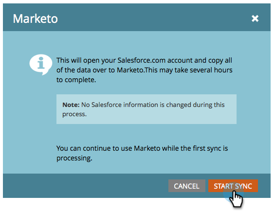

# Steg 3 av 3: Anslut Marketo Engage och [!DNL Veeva] CRM {#step-3-of-3-connect-marketo-engage-and-veeva-crm}

I den här artikeln konfigurerar du Marketo Engage att synkronisera med din konfigurerade [!DNL Veeva] CRM-instans. **Du kommer att se [!DNL Salesforce] i några av popup-fönstren** när [!DNL Veeva] CRM är byggt på [!DNL Salesforce]-plattformen.

>[!PREREQUISITES]
>
>* [Steg 1 av 3: Lägg till Marketo-fält i [!DNL Veeva]](/help/marketo/product-docs/crm-sync/veeva-crm-sync/setup/step-1-of-3-add-marketo-fields-to-veeva-crm.md){target="_blank"}
>* [Steg 2 av 3: Skapa en [!DNL Veeva] användare för Marketo](/help/marketo/product-docs/crm-sync/veeva-crm-sync/setup/step-2-of-3-create-a-veeva-crm-user-for-marketo-engage.md){target="_blank"}

>[!IMPORTANT]
>
>Det går bara att ansluta en Marketo-instans till en [!DNL Veeva] CRM-instans åt gången.

## Anslut till [!DNL Veeva] CRM med OAuth {#connect-to-veeva-crm-using-oauth}

1. Klicka på **[!UICONTROL Admin]** i Marketo. Markera **[!UICONTROL CRM]** och klicka på **[!UICONTROL Sync with Veeva]**.

   

   >[!NOTE]
   >
   >[Dölj alla fält som du inte behöver](/help/marketo/product-docs/crm-sync/salesforce-sync/sfdc-sync-details/hide-a-salesforce-field-from-the-marketo-sync.md){target="_blank"} i Marketo från synkroniseringsanvändaren innan du klickar på Synkronisera fält. När du klickar på Synkronisera fält skapas alla fält som användaren kan se i Marketo permanent och kan inte tas bort.

1. Klicka på **[!UICONTROL Login with Veeva]**.

   

   >[!NOTE]
   >
   >Markera [!UICONTROL Sandbox] om du synkroniserar en Marketo-sandlåda till en [!DNL Veeva] CRM-sandlåda.

1. Klicka på **[!UICONTROL Confirm Credentials]**.

   

1. Ett popup-fönster med inloggningssidan [!DNL Salesforce] visas. Ange dina autentiseringsuppgifter för Marketo Sync-användare och klicka på **[!UICONTROL Log In]**.

   

1. Ange verifieringskoden som du fick via e-post (skickad av [!DNL Salesforce]) och klicka på **[!UICONTROL Verify]**.

   

1. När verifieringen är klar visas åtkomstsidan och begär åtkomst. Klicka på **[!UICONTROL Allow]**.

   

1. Om några minuter visas ett popup-fönster i Marketo Engine. Klicka på **[!UICONTROL Confirm Credentials]**.

   

## Starta [!DNL Veeva]-synkronisering {#start-veeva-sync}

1. Klicka på **[!UICONTROL Start Veeva Sync]** för att påbörja den beständiga [!DNL Marketo-Veeva] CRM-synkroniseringen.

   

   >[!CAUTION]
   >
   >Marketo avduplicerar inte automatiskt mot en CRM-synkronisering av typen [!DNL Veeva] eller när du anger leads manuellt.

1. Klicka på **[!UICONTROL Start Sync]**.

   

>[!NOTE]
>
>Tiden det tar att slutföra den inledande synkroniseringen varierar beroende på databasens storlek och komplexitet.

## Verifiera synkronisering {#verify-sync}

Marketo tillhandahåller statusmeddelanden för CRM-synkroniseringen [!DNL Veeva] i administratörsområdet. Du kan kontrollera att synkroniseringen fungerar som den ska genom att följa dessa steg.

1. I Marketo klickar du på **[!UICONTROL Admin]** och sedan på **[!UICONTROL Veeva]**.

   

1. Synkroniseringsstatusen visas längst upp till höger. Det visar ett av tre meddelanden: Senaste synkronisering, Pågående synkronisering eller Misslyckades.

>[!MORELIKETHIS]
>
>[Konfigurera anpassade objekt](/help/marketo/product-docs/crm-sync/veeva-crm-sync/sync-details/custom-object-sync.md){target="_blank"}
