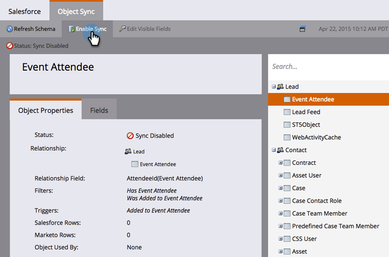

# Synkronisering av anpassat objekt {#custom-object-sync}

Anpassade objekt som skapas i din [!DNL Veeva] CRM-instans kan också ingå i Marketo Engage. Så här ställer du in det.

>[!NOTE]
>
>**Administratörsbehörigheter krävs**

>[!PREREQUISITES]
>
>Om du vill använda ett anpassat objekt måste det associeras med en kontakt eller ett kontoobjekt i [!DNL Veeva] CRM.

## Aktivera anpassat objekt {#enable-custom-object}

1. I Marketo klickar du på **[!UICONTROL Admin]** och sedan på **[!UICONTROL Veeva Objects Sync]**.

   

1. Om det här är ditt första anpassade objekt klickar du på **[!UICONTROL Sync Schema]**.

   

1. Klicka på **[!UICONTROL Disable Global Sync]**.

   

   >[!NOTE]
   >
   >Den inledande synkroniseringen av det anpassade objektschemat [!DNL Veeva] kan ta några minuter.

1. Dra det anpassade objekt som du vill synkronisera till arbetsytan.

   

   >[!NOTE]
   >
   >Anpassade objekt måste ha unika namn. Marketo stöder inte två olika anpassade objekt med samma namn.

1. Klicka på **[!UICONTROL Enable Sync]**.

   

1. Klicka på **[!UICONTROL Enable Sync]** igen.

   

1. Gå tillbaka till fliken **[!UICONTROL Veeva]**.

   

1. Klicka på **[!UICONTROL Enable Sync]**.

   

1. Om du vill visa alla dina [!DNL Veeva] anpassade objekt klickar du på **[!UICONTROL Admin]** och **[!UICONTROL Veeva Objects Sync]**.

   

   >[!NOTE]
   >
   >Marketo stöder bara anpassade entiteter som är länkade till standardenheter en till två nivåer djupt.

Underbar! Nu kan du använda data från det här anpassade objektet i Smarta kampanjer och Smarta listor.

>[!MORELIKETHIS]
>
>* [Synkroniserar meddelande för samtal och samtal](/help/marketo/product-docs/crm-sync/veeva-crm-sync/sync-details/syncing-call-and-call-key-messages.md){target="_blank"}
>* [Lägg till/ta bort anpassat objektfält som smart lista/utlösarbegränsningar](/help/marketo/product-docs/crm-sync/veeva-crm-sync/sync-details/add-remove-custom-object-field-as-smart-list-trigger-constraints.md){target="_blank"}
