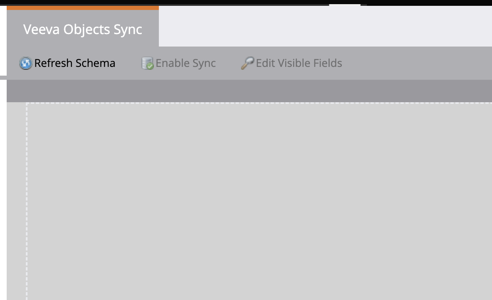

# Aktivera/inaktivera synkronisering av anpassat objekt {#enable-disable-custom-object-sync}

Egna objekt som skapas i Veeva CRM-instansen kan också ingå i Marketo Engage. Så här ställer du in det.

## Aktivera eller inaktivera synkronisering av anpassat objekt {#enable-or-disable-the-custom-object-sync}

>[!NOTE]
>
>**Administratörsbehörigheter krävs**

1. I Marketo klickar du på **[!UICONTROL Admin]** och sedan på **[!UICONTROL Veeva Objects Sync]**.

   

1. Om det här är ditt första anpassade objekt klickar du på Synkronisera schema. Om inte, klicka på **[!UICONTROL Refresh Schema]** för att kontrollera att du har de senaste.

   

1. Om den globala synkroniseringen körs inaktiverar du den genom att klicka på **[!UICONTROL Disable Global Sync]**.

   

   >[!NOTE]
   >
   >Det kan ta några minuter att synkronisera det anpassade objektschemat Veeva.

1. Klicka på **[!UICONTROL Refresh Schema]**.

   

Markera det objekt som du vill synkronisera och klicka på Aktivera synkronisering.

>[!TIP]
>
>Marketo kan bara synkronisera ett anpassat objekt om det har en direkt relation till kontakt- eller kontoobjektet i Veeva CRM.

1. Klicka på **[!UICONTROL Enable Sync]** igen.

   

1. Gå tillbaka till fliken Veeva och klicka på **[!UICONTROL Enable Sync]**.

   

## Använda egna objekt {#using-your-custom-objects}

>[!NOTE]
>
>Du kan inte använda anpassade objekt i smarta kampanjer med utlösare.

1. I den smarta listan drar du över filtret Har möjlighet och anger **[!UICONTROL True]**.

   

1. Du kan även använda filterbegränsningar för att begränsa fokus.

   

Underbar! Nu kan du använda det här anpassade objektets data i Smarta kampanjer och Smarta listor.

>[!MORELIKETHIS]
>
>[Lägg till/ta bort anpassat objektfält som smart lista/utlösarbegränsningar](/help/marketo/product-docs/crm-sync/veeva-crm-sync/sync-details/add-remove-custom-object-field-as-smart-list-trigger-constraints.md){target="_blank"}
