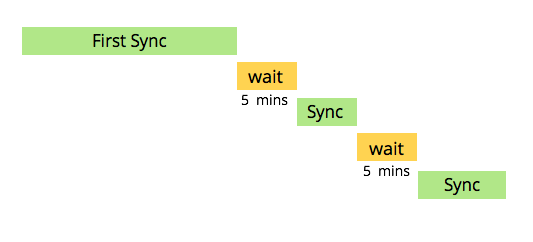

# CRM-synkronisering för [!DNL Veeva] {#understanding-the-veeva-crm-sync}

Med några enkla steg är det enkelt att köra en synkronisering mellan Adobe Marketo Engage och [!DNL Veeva] CRM.

## Så här fungerar synkroniseringen {#how-the-sync-works}

Marketo Engage synkroniserar med [!DNL Veeva] CRM hela dagen, varje dag. Varje synkronisering tar en stund, pausar i 5 minuter och startar sedan igen.

>[!NOTE]
>
>Den allra första synkroniseringen kan ta timmar eller till och med dagar eftersom Marketo Engage kopierar hela databasen från [!DNL Veeva]. Efter det tar varje synkronisering vanligtvis minuter (ibland sekunder) och synkroniserar bara data som har ändrats.

Synkroniseringen mellan [!DNL Veeva] och Marketo Engage är endast dubbelriktad för kontaktfält i Person-kontoobjektet. När du gör ändringar i antingen [!DNL Veeva] eller Marketo Engage återspeglas dina uppdateringar i båda systemen. Alla andra synkroniseringar är endast från [!DNL Veeva] till Marketo Engage. Klicka på länkarna nedan om du vill ha information om var och en av länkarna.

## Vad synkroniseras mellan Marketo Engage och [!DNL Veeva] {#what-is-synced-between-marketo-engage-and-veeva}

* [Personkonton](/help/marketo/product-docs/crm-sync/veeva-crm-sync/sync-details/person-account-sync-faq.md){target="_blank"}
* Användare
* [Anropa och anropa nyckelobjekt](/help/marketo/product-docs/crm-sync/veeva-crm-sync/sync-details/syncing-call-and-call-key-messages.md){target="_blank"}
* [Egna objekt](/help/marketo/product-docs/crm-sync/veeva-crm-sync/sync-details/custom-object-sync.md){target="_blank"}

## Saker att veta {#things-to-know}

* De [autentiseringsuppgifter du anger i Marketo Engage för [!DNL Veeva]](/help/marketo/product-docs/crm-sync/salesforce-sync/setup/enterprise-unlimited-edition/step-2-of-3-create-a-salesforce-user-for-marketo-enterprise-unlimited.md){target="_blank"} används för att synkronisera data. Endast data som dessa autentiseringsuppgifter har åtkomst till inkluderas.

* CRM för [!DNL Veeva] baseras på force.com och den omfattande upplevelse som Marketo Engage har med plattformen ärvs i den här synkroniseringen.

* Veeva CRM visar: Lead, Contact, Accounts, Business Accounts, Opportunity, Campaign och Activity. De stöds dock inte vid synkronisering med Marketo Engage.
