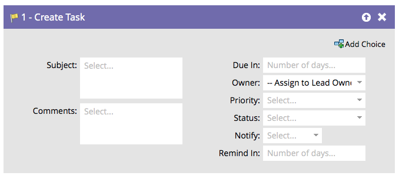
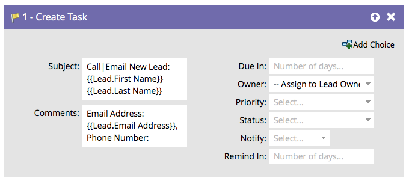

# Skapa uppgift i veva {#create-task-in-veeva}

Som marknadsförare har ni information som kan hjälpa försäljningen att sluta avtal. Du kan skapa uppgifter för att tala om för dem vad de ska göra och när de ska göra det.

>[!NOTE]
>
>När Marketo Sync User skapar uppgifter **Förfaller** är ett obligatoriskt fält för uppgiften som ska skapas i Veeva. Marketo anger fem dagar som standard om det inte finns något värde.

Som standard ser flödessteget ut så här:

Anpassa alla fält för att skapa uppgiften som du vill.

>[!TIP]
>
>Du kan använda `{{lead.tokens}}`, `{{company.tokens}}`, `{{campaign.tokens}}` och `{{system.tokens}}` i ämnet och beskrivningen. Se [Token för flödessteg](/help/marketo/product-docs/core-marketo-concepts/smart-campaigns/flow-actions/use-tokens-in-flow-steps.md){target=&quot;_blank&quot;} om du vill ha mer information.
