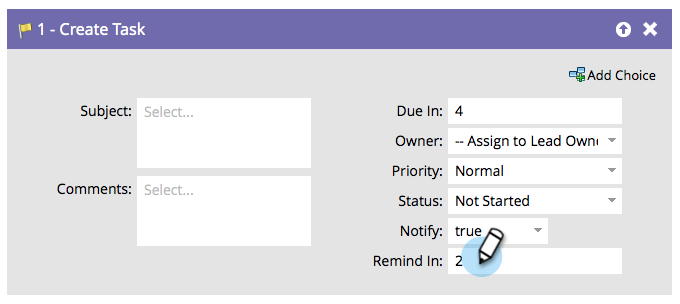

# Create Task in Veeva {#create-task-in-veeva}

As a marketer, you have information that can assist sales in closing deals. You can create tasks to let them know what they should do and when they should do it.

>[!NOTE]
>
>**** Marketo will input five days by default if there is no value.

By default, the flow step will look like this:

Customize all fields to create the task the way you want it.

>[!TIP]
>
>`{{lead.tokens}}``{{company.tokens}}``{{campaign.tokens}}``{{system.tokens}}` 
