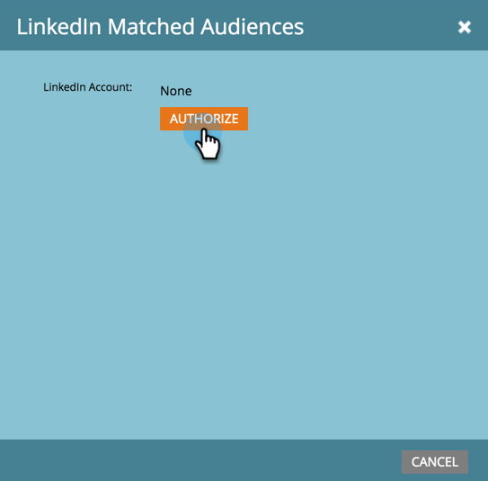

# Lägg till LinkedIn-matchade målgrupper som en LaunchPoint-tjänst {#add-linkedin-matched-audiences-as-a-launchpoint-service}

>[!NOTE]
>
>**Administratörsbehörigheter krävs**

Koppla ditt Marketto-konto till LinkedIn Matched Audiences om du vill använda en statisk Marketo-lista eller smart lista som ett LinkedIn-målgruppssegment.

1. Gå till avsnittet **Admin**.

   

1. Välj **Startpunkt**.

   

1. Välj **Ny** och **Ny tjänst**.

   

1. Ange ett **visningsnamn** och välj **LinkedIn Matched Audiences**. Klicka på **Skapa**.

   

1. Om du vill ansluta ett LinkedIn-konto klickar du på **Auktorisera**.

   

   >[!CAUTION]
   >
   >För att Marketto ska kunna skicka målgrupper över flera LinkedIn-annonskonton måste den LinkedIn-användare som du auktoriserar i följande steg ha tillgång till *alla* dessa annonskonton i sin Campaign Manager.

1. LinkedIn öppnas på en ny flik. Logga in på ditt LinkedIn-konto härifrån.

   

1. Granska de begärda behörigheterna och klicka sedan på **Tillåt**.

   

1. Ditt LinkedIn-konto är nu anslutet till Marketo. Klicka på **Skapa**.

   

   Häftig! Nu visas LinkedIn Matched Audiences som en LaunchPoint-tjänst på fliken Installerade tjänster.

   

>[!MORELIKETHIS]
>
>* [Använd en Marketo-lista eller en smart lista som ett LinkedIn-målsegment](../../../product-docs/demand-generation/social/social-functions/use-a-marketo-list-or-smart-list-as-a-linkedin-audience-segment.md)

>

