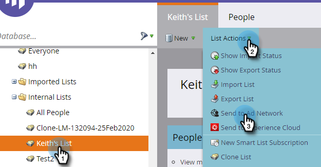
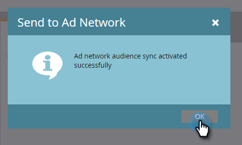

# Skicka en lista till ett annonsnätverk {#send-a-list-to-an-ad-network}

Lär dig hur du skickar en statisk lista till LinkedIn, Facebook eller Google.

## Skicka en lista {#how-to-send-a-list}

1. I Marketo markerar du listan, klickar på listrutan **Visa åtgärder** och väljer **Skicka till annonsnätverk**.

   

1. Välj mellan LinkedIn, Facebook eller Google (de andra alternativen är inte tillgängliga just nu). I det här exemplet väljer vi **LinkedIn**. Klicka på **Nästa**.

   

1. Klicka på listrutan Målgrupp och välj önskad målgrupp.

   

   >[!TIP]
   >
   >Om du någon gång behöver kontrollera kan du se målgruppen som en lista synkroniseras till via fliken Status.

1. Välj önskad penseltyp och klicka på **Uppdatera**.

   

   >[!NOTE]
   >
   >Om du väljer Enable continuous audience sync (Aktivera kontinuerlig målgruppssynkronisering) håller Marketo listan uppdaterad i det valda annonsnätverket när listmedlemskapet ändras i Marketo-instansen.

1. Och det är allt! Klicka på **OK** för att avsluta.

   

## Vanliga frågor och svar {#faq}

**Kan en enda statisk lista synkroniseras med flera annonspubliker?**

Nej, en lista kan bara synkroniseras till en enda målgrupp.

**Om jag aktiverar kontinuerlig synkronisering med en befintlig annonspublik, kommer den befintliga publiken att ersättas?**

Nej, den befintliga publiken läggs till, inte ersätts.
