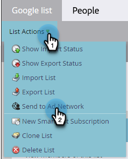

# Skicka en lista till Google {#send-a-list-to-google}

För dem som använder Google Customer Match följer du stegen nedan för att skicka en statisk Marketo Engage-lista till ditt Google-konto.

1. I Marketo Engage söker du efter och markerar önskad lista.

   

1. Klicka på **Liståtgärder** nedrullningsbar meny och välj **Skicka till annonsnätverk**.

   

1. Välj Google och klicka **Nästa**.

   

1. Välj önskat annonskonto. Du kan välja en befintlig målgrupp eller skapa en ny. I det här exemplet skapar vi en ny. Ge den nya publiken ett namn.

   

1. Gör valfria markeringar.

   

   >[!NOTE]
   >
   >* Markera **Synkronisera målgruppsmedlemskap** håller listan uppdaterad när den ändras i din instans. Vi lägger till/tar bort personer från målgruppen när de läggs till/tas bort från den statiska listan.
   >
   >* Om du markerar kryssrutan längst ned skickas medgivandestatusen som GRANTED för användardata som skickas till Google Ads för reklam och annonspersonalisering. Om du inte markerar alternativet skickas medgivandestatusen som OSPECIFIERAD. För dem som planerar att överföra uppgifter till användare i Europeiska ekonomiska samarbetsområdet (EES) har Google sammanställt en lista med [Vanliga frågor](https://support.google.com/google-ads/answer/14310715){target="_blank"}samt ytterligare information som visar [Policy för användargodkännande i EU](https://www.google.com/about/company/user-consent-policy/){target="_blank"}.

1. Klicka **Uppdatera**.

   

1. Klicka **OK** för att avsluta.

   
