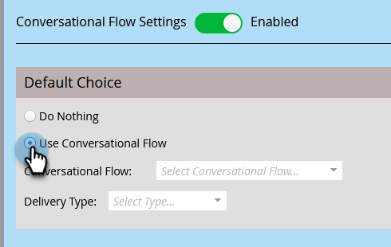

# Konversationsflödesinställningar för Marketo Engage Forms{#conversational-flow-settings-for-marketo-engage-forms}

Skapa samtal mellan Marketo Engage Forms genom att integrera dem med Dynamic Chat Conversational Flows. Hitta leads direkt med hjälp av formulärdata eller Smart List-medlemskap för mötesbokningar, rapporter eller anpassade mål.

>[!PREREQUISITES]
>
>LÄGG TILL FÖREGÅENDE HÄR

>[!AVAILABILITY]
>
>Medlem i Smart List eller Medlem i List-kriterier kräver Dynamic Chat Prime. Kontakta kontoteamet (din kontoansvarige) för mer information.

1. Hitta och välj ett formulär (eller skapa ett nytt).

   

1. Klicka **Redigera utkast**.

   

1. Klicka på **Formulärinställningar** sedan **Inställningar**.

   

1. Klicka på **Konversationsflödesinställningar** skjutreglage som ska aktiveras.

   

1. Ett standardalternativ visas. Välj din inställning. I det här exemplet väljer vi **Använd konversationsflöde**.

   

1. Välj önskat konversationsflöde och leveranstyp.

   

   >[!NOTE]
   >
   >[Läs mer om konversationsflöden](/help/marketo/product-docs/demand-generation/dynamic-chat-two/automated-chat/conversational-flows-overview.md){target="_blank"}

   **VALFRITT STEG**: Du kan klicka på Lägg till val om du vill rikta in dig på chattbesökare som uppfyller ett visst villkor.

   

   >[!IMPORTANT]
   >
   >Besökarens webbläsare måste vara en känd person som cookie innan formuläret skickas in för att bli berättigad till medlem i en statisk/smart lista.

1. Klicka **Slutför** när det är klart.

   
