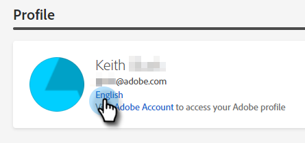
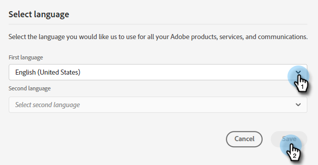

# Översikt över Dynamic Chat {#dynamic-chat-overview}

Med Dynamic Chat kan ni utnyttja ett lättanvänt gränssnitt för att nå ut till både personer och konton på er webbplats. Samla in relevant innehåll som namn, kontaktinformation och fritext. Besökarna kan även boka möten med säljteamet. Dynamic Chat-aktivitet och engagemangsdata kan användas för att lägga till medlemmar i Marketo-program och aktivera flerkanalsaktiviteter.

>[!TIP]
>
>Besök [den här sidan](https://experienceleague.adobe.com/docs/marketo-learn/tutorials/dynamic-chat/dynamic-chat-overview.html){target="_blank"} för att visa självstudiekurser om Dynamic Chat.

## Integreringar {#integrations}

En viktig komponent i Dynamic Chat är möjligheten att ha ett gränssnitt för Marketo-prenumerationer. För att kunna utnyttja den här integreringens fulla kapacitet måste du först initiera datasynkroniseringen. Beroende på storleken på din Marketo-databas kan det ta upp till 24 timmar för data för den första, [engångssynkronisering](/help/marketo/product-docs/demand-generation/dynamic-chat-two/integrations/adobe-marketo-engage.md){target="_blank"} för att slutföra.

Följande synkroniseras:

* Personfältdata
* Företagsfältdata
* Aktivitetsdata

## Dialogrutor {#dialogues}

Dialoger representerar ett enda chattengagemang. Se det som en behållare med allt du behöver för att få en engagerande chattdialog till webbplatsens besökare. I varje dialogruta kan du ange vilka sidor du vill att dialogrutan ska visas på, till vilka du vill att den ska visas samt innehållet och flödet för själva dialogrutan. Dessutom kan du hitta mätvärden för att se hur bra din dialog fungerar. [Läs mer om dialogrutor](/help/marketo/product-docs/demand-generation/dynamic-chat-two/automated-chat/dialogue-overview.md){target="_blank"}.

## Konfiguration {#configuration}

Anpassa utseendet på dina olika dialogrutor på fliken Konfiguration. Ändra typsnitt, färger, svarstid med mera! [Läs mer om konfiguration](/help/marketo/product-docs/demand-generation/dynamic-chat-two/setup-and-configuration/configuration.md){target="_blank"}.

## Kalender {#calendar}

Anslut Outlook- eller Gmail-kalendern för användning vid schemaläggning av möten i chattbot. [Läs mer om Kalender](/help/marketo/product-docs/demand-generation/dynamic-chat-two/setup-and-configuration/agent-settings.md#connect-calendar){target="_blank"}

## Möten {#meetings}

Här ser du alla avtalade tider som har schemalagts av webbplatsbesökare via olika dialogrutor. [Läs mer om möten](/help/marketo/product-docs/demand-generation/dynamic-chat-two/meeting-list.md){target="_blank"}

## Routning {#routing}

Här kan du se en lista över alla agenter som har kopplat samman sina kalendrar, i vilken ordning de presenteras för webbplatsens besökare och skapa anpassade routningsregler. [Läs mer om routning](/help/marketo/product-docs/demand-generation/dynamic-chat-two/setup-and-configuration/routing.md){target="_blank"}

## Live Chatt {#live-chat}

Erbjud dina kvalificerade webbbesökare att komma i kontakt med säljarna via [live-chatt](/help/marketo/product-docs/demand-generation/dynamic-chat-two/live-chat/live-chat-overview.md){target="_blank"}.

## Vanliga frågor {#faq}

**Kan jag installera Dynamic Chat var som helst på min företagswebbplats eller fungerar det bara på Marketo landningssidor?**

JavaScript-kodfragmentet Dynamic Chat kan installeras på alla webbplatser och på Marketo landningssidor.

**Hur länge lagras data för rapportering?**

90 dagar.

**Tillåter Dynamic Chat live-chatt?**

Nej, det använder bara förbestämda svar.

**Har Dynamic Chat stöd för andra språk än engelska?**

Ja. Dynamic Chat stöder följande språk: franska, tyska, japanska, spanska, italienska, brasiliansk portugisiska, koreanska, förenklad kinesiska och traditionell kinesiska. Läs mer i [avsnitt nedan](#changing-the-language).

**Stöder du AI/NLP-funktioner?**

Vi stöder inte AI/NLP-funktioner.

**Hur kan jag rikta mig till anonyma människor?**

I dialogrutan måste du använda _Personens e-postadress är tom_ -attribut.

## Ändra språk {#changing-the-language}

Följ de här stegen för att ändra Dynamic Chat.

>[!IMPORTANT]
>
>Om du ändrar ditt språk på profilnivå ändras språket för _alla_ Experience Cloud, inte bara Dynamic Chat.

1. Klicka på inställningsikonen på ditt Experience Cloud-konto och välj **Inställningar**.

   

1. Klicka på det aktuella språket under din e-postadress.

   

1. Välj ditt nya språk (det andra språket är valfritt) och klicka på **Spara**.

   

   >[!NOTE]
   >
   >Det finns ett par dussin språk att välja bland, men Dynamic Chat stöder bara följande: engelska, franska, tyska, japanska, spanska, italienska, brasiliansk portugisiska, koreanska, förenklad kinesiska och traditionell kinesiska.

När du uppdaterar språket ändras allt i själva programmet utom orden som du har fyllt i personligen (t.ex. strömningssvar).

## Bevarandegränser för data i Dynamic Chat {#dynamic-chat-data-retention-limits}

<table>
  <th>Datatyp</th>
  <th>Kvarhållningsperiod</th>
 <tr>
  <td>Anonym lead utan engagemang</td>
  <td>90 dagar</td>
 </tr>
 <tr>
  <td>Målaktivitet</td>
  <td>24 månader</td>
 </tr>
 <tr>
  <td>Dokumentaktivitet</td>
  <td>24 månader</td>
 </tr>
 <tr>
  <td>Interaktion med dialogaktivitet</td>
  <td>90 dagar</td>
 </tr>
 <tr>
  <td>Mötesbokningsaktivitet</td>
  <td>24 månader</td>
 </tr>
</table>
