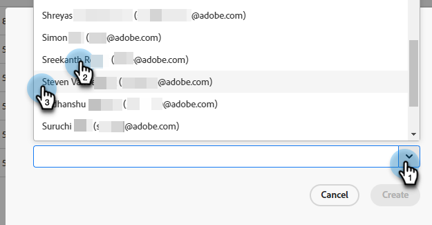

# Agenthantering {#agent-management}

I Agenthantering kan du visa en lista med agenter i din Dynamic Chat-instans, hantera team och ange dina reservregler.

## Agenter {#agents}

På den här fliken visas alla agenter i din Dynamic Chat-instans och den innehåller information om deras namn, e-postadress, Live-chattstatus med mera.

PICC2 - BEHÖVER SCREENSHOT FRÅN GUYS

## Team {#teams}

Administratörer kan skapa team med agenter för att underlätta dirigering till specifika grupper av säljare.

### Skapa ett team {#create-a-team}

1. Klicka **+ Skapa team**.

   

1. Ge teamet ett namn.

   

1. Klicka på **Lägg till agenter** och välj önskade agenter.

   

1. Klicka **Skapa**.

   

## Reservregler {#fallback-rules}

### Mötesreserv {#meeting-fallback}

Välj ett standardmeddelande (systemmeddelande) eller skriv ett anpassat meddelande så att besökarna kan se när mötesbokningen är otillgänglig.

### Live Chatt Fallback {#live-chat-fallback}

Välj ett standardmeddelande (systemmeddelande) eller skriv ett anpassat meddelande så att besökarna kan se när Live-chatten är otillgänglig.

>[!NOTE]
>
>Markera **Inkludera bokningsalternativ för möte** kommer att generera en mötesbokningswidget för chattbesökaren.

>[!TIP]
>
>När du skapar ett anpassat meddelande kan du formatera teckensnittet, använda länkar och till och med infoga känslolägesikoner! `:)`
