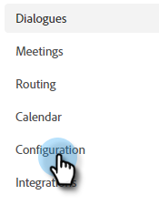

# Konfiguration {#configuration}

Lär dig hur du anpassar utseendet på chatbot-dialogrutan.

Kom igång genom att klicka **Konfiguration**.

Det finns flera olika anpassningsalternativ.

## Fliken Format {#style-tab}

### Stil {#style}

Här definierar du utseendet och känslan för den chattbot där dina dialogrutor ska visas, inklusive: färger, teckensnitt, placering av robotwidgeten och chatbogens namn/avatar.

Färgen för varje kategori bestäms av en [hexadecimalt färgvärde](https://color.adobe.com/create/color-wheel) (t.ex. vit = #ffffff, röd = #bf1932 osv.)

Med ankarpunkten kan besökaren öppna/stänga chatbox. Du kan välja om ikonen ska visas längst ned till höger eller längst ned till vänster. Du kan också öka/minska utfyllnaden (mängden utrymme mellan ikonen och webbsidans nederkant).

### Agentinställningar {#agent-settings}

I Agentinställningar kan du lägga till en etikett i din chatbox (t.ex. &quot;Adobe Bot&quot;) som visas högst upp i den. Du kan också fastställa fördröjningen för svar (i sekunder) och ändra din chattavatar. Om du vill ladda upp en egen avatarbild klickar du på **+** -knappen.

>[!NOTE]
>
>Anpassade avatarer ska vara fyrkantiga bilder som är mindre än 256 kb och mindre än 200 x 200 px. Filtyper som stöds: .jpg, .png, .gif, .webp, .svg.

Kom ihåg att klicka när du är klar med ändringarna **Spara**.

## Sekretessflik {#privacy-tab}

Klicka på **Integritet** för att lägga till/redigera URL:en för webbplatsens sekretesspolicy (valfritt).

## Installationsflik {#installation-tab}

För att chattbot ska visas på webbplatsen måste du först installera JavaScript-kodfragmentet Dynamic Chat. Klicka på den här fliken om du vill söka efter/kopiera den nödvändiga koden. Om du inte känner till den här åtgärden kan du kontakta ditt webbteam eller din IT-avdelning för att få hjälp.

>[!TIP]
>
>Om webbplatsen använder en skyddsprofil för innehåll kan du behöva vitlista följande URL:er för att chattbot ska fungera som förväntat:
>
>* `*.adoberesources.net`
>* `*.adobe.io`
>* `*.typekit.net`

>[!NOTE]
>
>Marketo Support har inte konfigurerats för att hjälpa till med felsökning av HTML. Kontakta en webbutvecklare om du behöver hjälp med HTML.
